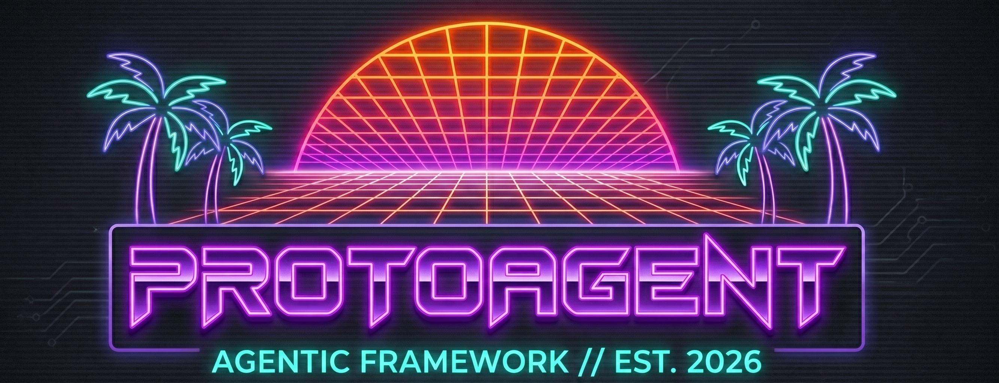

# ProtoAgent

<div align="center">
  
</div>

ProtoAgent is a local-first coding agent built around a fast Rust terminal UI
and a Python core powered by [ProtoLink](https://github.com/nMaroulis/protolink).
Its runtime is designed to give smaller models narrow roles, bounded evidence,
and deterministic completion checks instead of one large prompt with every
tool attached.

Release `0.2.0` covers the active `proto-cli` and `protoagent-core`
components. The ACP editor bridge remains a planned `0.0.0-dev.0` component.
See [VERSIONING.md](VERSIONING.md) and [CHANGELOG.md](CHANGELOG.md).

## Why ProtoAgent

- **Small-model first:** `small`, `medium`, `large`, and `api` prompt profiles
  tune delegation depth without changing the safety boundary.
- **Visible context:** Context Loom incrementally indexes the workspace and
  builds a bounded, source-cited Context Pack before inference.
- **Narrow agent roles:** Architect coordinates; Explorer reads the repository;
  Coder prepares policy-gated changes; optional Scout researches the public
  web.
- **ProtoLink as the engine:** ProtoLink owns agent discovery, delegation,
  tools, state, events, approvals, cancellation, transports, and run reports.
- **Runtime completion checks:** ProtoAgent derives an application-level
  `RunContract` and does not treat unsupported prose as a completed write task.
- **Operator-visible behavior:** the Rust CLI exposes provider, model, context,
  agent, readiness, timeline, trace, diff, and session state.

## Architecture

| Surface | Status | Responsibility |
| --- | --- | --- |
| `cli/` | Active, `0.2.0` | Rust CLI/TUI, project and model controls, approvals, cancellation, and diagnostics. |
| `core/` | Active, `0.2.0` | Python application logic, Context Loom, prompt profiles, agent factories, and the ProtoLink runtime bridge. |
| `acp/` | Planned, `0.0.0-dev.0` | Future editor-facing Agent Client Protocol adapter. |

The default coding deck is intentionally asymmetric:

| Role | State | Authority |
| --- | --- | --- |
| **Architect** | Persistent project conversation | Plans, delegates, and produces the final response; no workspace tools. |
| **Explorer** | Task-local | Reads and searches the selected workspace. |
| **Coder** | Task-local | Prepares file changes; every write crosses the approval boundary. |
| **Scout** | Tool-only, no memory, disabled by default | Exposes ProtoLink's bounded `web_search` and `fetch_url` tools with `network.read`. |

Scout is optional because external research changes the privacy and trust
boundary. Enable it only when a task needs current public information:

```bash
proto-cli agents scout on
```

Or inside the TUI:

```text
/agents scout on
```

The setting applies to the next run. When enabled, Scout is registered with the
same ProtoLink mesh, so Architect can discover it and call its tools. Search and
fetched text are treated as untrusted input; Scout has no workspace
tools. Brave search uses `BRAVE_SEARCH_API_KEY`; DuckDuckGo is keyless
best-effort search, and English Wikipedia is keyless factual search.

For the complete design, read the [whitepaper](whitepaper.md) and the
[maintainer documentation](https://nmaroulis.github.io/protoagent/).

## Install

Requirements:

- Python 3.12 or newer
- Rust toolchain with Cargo 1.83 or newer
- a supported local or API model provider

Release staging note: ProtoLink 0.6.6 must be available from the selected
package index before the ProtoAgent 0.2.0 install can resolve.

```bash
git clone https://github.com/nMaroulis/protoagent.git
cd protoagent

python3 -m venv .venv
source .venv/bin/activate
python -m pip install "protolink[http,llms]>=0.6.6"
python -m pip install -e core

cargo build --release --locked --manifest-path cli/Cargo.toml
```

Start the TUI from the repository root:

```bash
cargo run --locked --manifest-path cli/Cargo.toml -- project set /path/to/project
cargo run --locked --manifest-path cli/Cargo.toml -- start
```

Or run one task:

```bash
cargo run --locked --manifest-path cli/Cargo.toml -- run \
  "explain the authentication flow and propose a safer change"
```

Useful first checks:

```bash
cargo run --locked --manifest-path cli/Cargo.toml -- version
cargo run --locked --manifest-path cli/Cargo.toml -- check
cargo run --locked --manifest-path cli/Cargo.toml -- agents
```

Provider setup, every CLI command, Context Loom behavior, and troubleshooting
are covered in the [documentation](https://nmaroulis.github.io/protoagent/docs/intro).

## Safety And Privacy

Coder tools declare `workspace.write`. Before a write runs, ProtoLink policy
emits a typed approval request with a `text/x-diff` preview, and the application
returns a correlated approval decision. Esc or Ctrl-C requests cancellation
through ProtoLink's task-control path.

“Local-first” describes the default architecture, not a guarantee that every
configuration is offline. Local providers can keep model traffic on the
machine. API providers send model inputs to their configured endpoint, and
enabling Scout sends search/fetch requests to public internet services. Durable
ProtoLink trace output is opt-in through `PROTOAGENT_TRACE=1`.

## Project Status

The Rust CLI and Python core are the supported surfaces in `0.2.0`. The
[ACP directory](acp/README.md) is a roadmap placeholder; it is not currently an
installable editor server. Contributions should keep code, CLI help, readiness
output, docs, tests, and the changelog aligned.

## License

ProtoAgent is available under the [MIT License](LICENSE).
