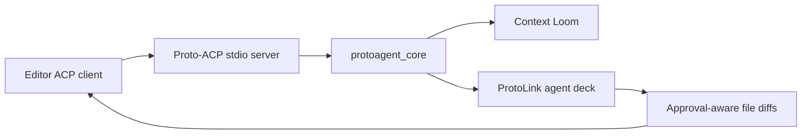

The `acp/` folder currently contains planning documentation only. There is no
checked-in server implementation in this repo yet, so this section intentionally
documents the intended role and marks protocol details as TBD.

## Current Status

| Item | Status |
| --- | --- |
| `acp/README.md` | Present. Describes the intended editor bridge. |
| ACP stdio server code | TBD. |
| ProtoLink core integration | TBD. |
| Editor config examples | Draft only. |
| Dynamic MCP tool mapping | Planned. |
| Registry submission | Planned. |

## Intended Role

Proto-ACP is planned as the editor-facing frontend for the same Python core used
by the CLI.

The target design:

## Relationship To The CLI

The ACP server should not reimplement the agent runtime. It should reuse:

| Existing core surface | Why ACP should reuse it |
| --- | --- |
| `agent_engine.process_prompt()` | Same Context Loom, agent deck, runtime response schema. |
| `config.py` and `models.py` | Same provider and model config. |
| `runtime.py` | Same ProtoLink execution path. |
| `history.py` | Same model-facing conversation state. |
| `tools.py` | Same workspace path safety and diff behavior. |

The editor surface will need a different approval UX, but the authorization
boundary should remain ProtoLink `RunAction` and `ApprovalDecision`.

## Documentation Rule

Until implementation exists, ACP docs should avoid promising completed behavior.
Keep concrete implementation docs under `ACP / Plan` and update this overview
once server files are added.
