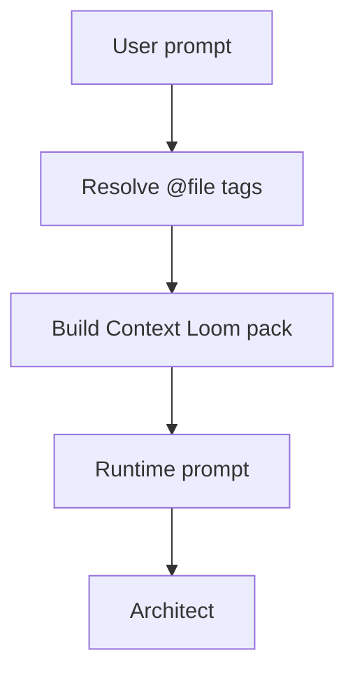

Context Loom is the user-visible context layer in the CLI. It gives a local,
source-cited view of what ProtoAgent thinks is relevant before or during a run.

## CLI Commands

| Command | Purpose |
| --- | --- |
| `/context` | Show index status for the active project. |
| `/context QUERY` | Build a Context Pack preview without calling a model. |
| `/index refresh` | Run an incremental refresh of the local SQLite index. |
| `/context window [16k\|auto]` | Show, set, or reset the Ollama context window. |
| `/context history` | Inspect model-facing ProtoLink conversation history. |
| `/context compact [recent\|tokens\|summary] [limit]` | Compact saved histories. |
| `/context reset` | Clear saved histories for the active project session. |
| `/context on` | Use persistent project memory. |
| `/context off` | Use task-local memory. |

Shell equivalents:

```bash
proto-cli context
proto-cli context "runtime streaming task handling"
proto-cli index refresh
proto-cli context history
proto-cli context compact tokens 4000
```

## Automatic Injection

Plain task prompts automatically get Context Loom evidence before the model is
called. `/context QUERY` is a preview/debug command, not the only way Context
Loom runs.

Task flow:



## What The Status Panel Shows

The status output comes from `context_status_rows()` and includes:

| Field | Meaning |
| --- | --- |
| `Name` | Always Context Loom. |
| `Workspace` | Active project path. |
| `Index` | SQLite index path. |
| `Files` | Number of indexed files. |
| `Indexed at` | Last index timestamp. |
| `Duration` | Last index refresh duration. |
| `Updated` | Files upserted during refresh. |
| `Unchanged` | Files skipped because stored size and modification time still match. |
| `Removed` | Stale files removed. |
| `Skipped` | Candidate files skipped after the file cap or a stat/read/decode failure. |

Automatic prompt preparation uses this same incremental refresh. Unchanged
files are not reread, reparsed, or upserted on every task; only new/changed
files are processed and stale rows removed.

## What A Pack Preview Shows

The Context Pack panel includes:

| Field | Meaning |
| --- | --- |
| `Query` | The request used to score files. |
| `Workspace` | Active project. |
| `Items` | Number of selected evidence items. |
| `Terms` | Normalized query terms used by the scorer. |
| `Index` | Indexed file count and duration. |
| `Git` | Number of changed paths from `git status --short`. |

Each selected item can show path, language, score, reason, evidence, symbols,
headings, line range, and a bounded line-numbered snippet.

## Memory Controls Are Nearby On Purpose

The `/context` namespace covers both context evidence and model-facing memory
because the user experiences them together:

1. Context Loom decides what repository facts enter the current prompt.
2. ProtoLink state decides whether the agents remember previous project turns.
3. Runtime context metrics show how much of the model window the run consumed.

This is why `/context history`, `/context compact`, `/context reset`, and
`/context window` live next to `/context QUERY`.

## Common Debug Flow

Use this when a model seems to miss the relevant files:

```text
/project
/index refresh
/context the exact thing I am asking about
/trace
```

If `/context QUERY` produces the right files but the final answer is wrong, the
problem is likely in agent reasoning or tool use. If the pack misses the files,
inspect Context Loom scoring in `core/protoagent_core/context/packer.py`.
