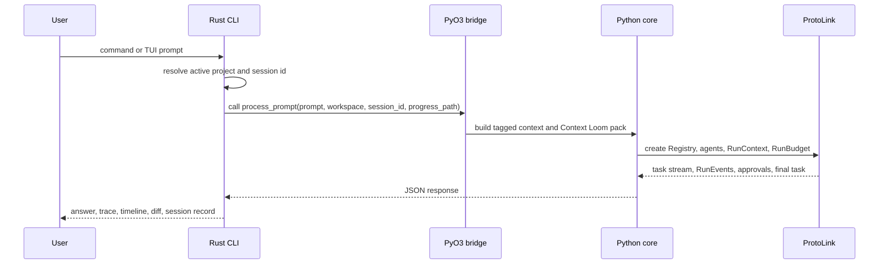

The CLI is the primary active frontend in this repo. It is implemented in Rust
under `cli/`, and it calls the Python core through PyO3. The CLI is not the
agent brain; it is the terminal cockpit.

Its job is to:

1. Keep startup and rendering fast.
2. Let users choose a project, provider, and model.
3. Render a fullscreen TUI with fixed panels, transcript, and bottom input.
4. Stream progress from the Python runtime through local JSONL files.
5. Display typed approval requests before workspace writes execute.
6. Request live task cancellation when the user presses Esc or Ctrl-C.
7. Store UI session summaries and expose trace/timeline/debug views.

## Runtime Boundary

The Rust code calls functions in `protoagent_core.agent_engine` and expects JSON
strings back. That boundary is deliberate: the CLI can stay a Rust UX shell
while Python owns provider config, Context Loom, ProtoLink runtime startup, and
agent orchestration.



## Two Operating Modes

| Mode | Entry command | Best for |
| --- | --- | --- |
| Fullscreen TUI | `proto-cli start`, `proto-cli tui`, `proto-cli cli` | Daily interactive work, panels, file tagging, model/key modal flows, live progress. |
| One-shot command | `proto-cli run "task"` | Debugging, shell scripts, copy-pasteable trace capture, non-fullscreen usage. |

The fullscreen TUI and one-shot runner share the same core functions and live
progress parser. They differ in presentation.

## Important Files

| File | Responsibility |
| --- | --- |
| `cli/src/main.rs` | Command routing, PyO3 functions, shell output panels, project/config helpers. |
| `cli/src/terminal_ui.rs` | Fullscreen loop, slash command routing, task loop, cancellation polling. |
| `cli/src/terminal_ui/render.rs` | Header, panels, transcript, command bar, context meter, bottom input. |
| `cli/src/terminal_ui/project.rs` | `/project` flow and `@file` picker. |
| `cli/src/terminal_ui/model_picker.rs` | `/model` and `/key` modal flows. |
| `cli/src/terminal_ui/approval.rs` | Runtime approval prompt. |
| `cli/src/terminal_ui/diff_view.rs` | Diff review modal and summaries. |
| `cli/src/progress.rs` | JSONL progress, context samples, approval/cancel control files. |
| `cli/src/timeline.rs` | `RunEvent` to trace and timeline rendering. |
| `cli/src/sessions.rs` | UI session ledger in `sessions.json`. |

## Data The CLI Owns

The CLI owns product-facing local state:

| State | Default location | Owner |
| --- | --- | --- |
| Active project and memory toggle | `~/.protoagent/project.json` | Rust CLI |
| UI session summaries | `~/.protoagent/sessions.json` | Rust CLI |
| Temporary progress and control files | OS temp directory | Rust CLI and Python bridge |

Model-facing state is owned by ProtoLink through the Python core:

| State | Default location | Owner |
| --- | --- | --- |
| Provider config and stored API keys | `~/.protoagent/config.json` | Python core |
| Per-agent conversation state | `~/.protoagent/conversations.sqlite` | ProtoLink state APIs |
| Context Loom indexes | `~/.protoagent/indexes/*.sqlite` | Python core |
| Durable local trace telemetry | `~/.protoagent/traces.jsonl` | ProtoLink telemetry when enabled |

## Agent Path

The CLI presents the runtime as an agent deck:

```text
[USER]
   |
   v
[CONTEXT LOOM] deterministic workspace index and evidence pack
   |
   v
[ARCHITECT] intent, routing, approval gate
   |
   +--> [EXPLORER] context pack, read_file, list_directory, search_regex, git status
   |
   +--> [CODER] generate_unified_diff, create_new_file
   |
   v
[HUMAN APPROVAL] before writes land on disk
```

The CLI does not parse model prose to decide whether a write is allowed. Writes
arrive as ProtoLink actions with capabilities, preview artifacts, and approval
requests.
