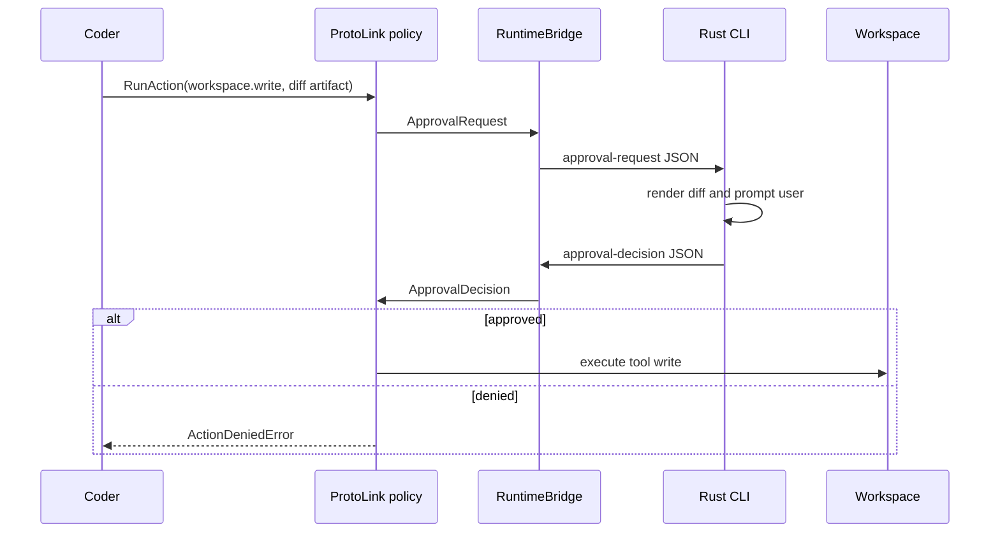

ProtoAgent's safety model is built around ProtoLink actions and policies, not
terminal string parsing.

## Approval-Gated Writes

Coder tools declare the `workspace.write` capability. The Coder policy marks
that capability as `require_approval`. When Coder calls a write tool:

1. Coder builds a `RunAction`.
2. The action includes a `text/x-diff` preview artifact.
3. ProtoLink evaluates policy.
4. ProtoLink calls the application approval handler.
5. The Python bridge writes an approval request JSON file.
6. Rust renders a diff and asks the user.
7. Rust writes an approval decision JSON file.
8. ProtoLink executes or denies the action.



## Temporary Control Files

The progress bridge uses OS temp paths named like:

```text
protoagent-progress-<pid>-<token>.jsonl
protoagent-progress-<pid>-<token>.jsonl.approval-request.json
protoagent-progress-<pid>-<token>.jsonl.approval-decision.json
protoagent-progress-<pid>-<token>.jsonl.cancel.json
```

They are cleaned up after a run. The cancellation file is intentionally
preserved during Python startup so an early Esc press is not lost.

## Trace Commands

| Surface | Command | Output |
| --- | --- | --- |
| TUI | `/trace` | Latest normalized trace in the transcript. |
| TUI | `/timeline` | Structured agent path. |
| TUI | `/diff` | Latest proposed diff or approval preview in a styled review modal with old/new line gutters. |
| Shell | `proto-cli run "task"` | Prints `AGENT TRACE`, `AGENT TIMELINE`, answer, and a styled diff. |
| Telemetry | `PROTOAGENT_TRACE=1` | Writes durable ProtoLink JSONL telemetry. |

Durable trace path:

```text
~/.protoagent/traces.jsonl
```

or:

```text
${PROTOAGENT_CONFIG_DIR}/traces.jsonl
```

## Best Debug Capture

```bash
PROTOAGENT_TRACE=1 proto-cli run "your failing task" 2>&1 | tee /tmp/protoagent-debug.txt
tail -n 80 "${PROTOAGENT_CONFIG_DIR:-$HOME/.protoagent}/traces.jsonl"
```

When running through Cargo:

```bash
PROTOAGENT_TRACE=1 cargo run --locked --manifest-path cli/Cargo.toml -- run "your failing task" 2>&1 | tee /tmp/protoagent-debug.txt
```

Use the terminal capture first. `traces.jsonl` can be empty if the failure
happened before telemetry initialized.

## Timeline Rendering

`cli/src/timeline.rs` consumes normalized `RunEvent` data first and falls back
to older string events when no structured events are available.

Timeline kinds include:

| Kind | Meaning |
| --- | --- |
| `SEND` | Architect delegated to another agent. |
| `RETURN` | Delegated result returned. |
| `MODEL` | LLM step or final model response. |
| `TOOL` | Tool call started or completed. |
| `ACTION` | Runtime action requested. |
| `POLICY` | Policy evaluated or denied action. |
| `APPROVAL` | Human approval requested or decided. |
| `CONTEXT` | Model context prepared. |
| `BUDGET` | Budget warning or exceeded event. |
| `TASK` | Task status or progress event. |
| `ERROR` | Runtime or task failure. |

## Cancellation

When a task is running, Esc or Ctrl-C writes a cancellation request. The Python
runtime monitor turns that into a ProtoLink `TaskCancellationRequest`.

Cancellation preference:

1. Call the in-process Architect agent when available.
2. Fall back to `AgentClient.cancel_task()` through the transport control plane.
3. Report when cancellation arrived after a terminal state.

If cancellation succeeds, the final response status is `canceled` and the answer
is a cancellation message rather than the original prompt.

## Scaffold Mode

Use scaffold mode to test the Rust/Python contract without contacting a model:

```bash
PROTOAGENT_SCAFFOLD=1 proto-cli run "show diagnostics"
```

The core still resolves tagged files, builds Context Loom evidence, reads
provider config, and returns the same response schema.
