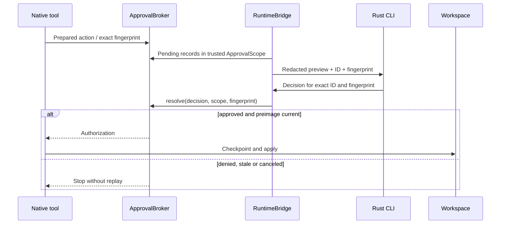

ProtoAgent's safety model is built around ProtoLink actions and policies, not
terminal string parsing.

## Approval-Gated Writes

Coder registers native `filesystem_tools()` with explicit project roots and
checkpoint storage. `filesystem.write` and `filesystem.restore` require approval.
The native tool prepares a `RunAction` with an exact diff and preimage before
`ApprovalBroker` waits for a decision.



## Command approval and recovery

Verifier's native `execute_command` requires `process.execute` approval. Its
JSON preview contains argv, absolute cwd, explicit env, timeout, output cap and
host execution boundary. Press V to inspect it. Commands run with host access,
without sandbox isolation; no environment is inherited implicitly.

`/undo [id]` selects an applied native change and asks for a fresh restoration
approval without a model. Native revision conflicts preserve newer edits.
Uncertain effects require inspection. See [Verify & Recover](verification-and-recovery.md).

## Temporary control files

Rust creates a private directory under the OS temp directory, with 0700
permissions on POSIX. Its progress and control files use 0600:

```text
protoagent-progress-<pid>-<nonce>-<token>/
  progress.jsonl
  progress.jsonl.approval-request.json
  progress.jsonl.approval-decision.json
  progress.jsonl.cancel.json
```

The directory is removed after the run. Python preserves a cancellation already
written during startup. Broker state is held natively and persisted in a private
per-run database; these temporary files are only the UI adapter. Fingerprints
correlate decisions; authentication comes from the private local control channel
and the application's trusted mesh authorization, not UI-supplied scopes.

## Live output

Live generation is enabled by default in `proto-cli run` and the TUI. The TUI
streams answer text under **AGENT / architect** (or **AGENT / guide** for help), with a cyan prompt and blinking
mint `_` cursor. JSON action wrappers stay hidden. Completion settles into the
same message, updates its status and hides the cursor without changing layout. `/trace` opens the
full run details without duplicating the answer in the conversation.

Worker activity appears in the status area; `/trace` includes retained worker
text and command stdout/stderr, labeled by agent and channel. These previews
retain the last 4096 characters of up to four streams;
the Architect answer stays complete. Streamed text remains provisional, and a
repair can replace it. Worker completion and `llm_final` do not complete the
whole run: the final response and status come from the native task result.

Use `PROTOAGENT_STREAM=0` to hide live previews. Esc/Ctrl-C cancels in the TUI;
Ctrl-C in shell mode also requests native cancellation and waits for cleanup.
Guide help follows the same controls in both `/help QUESTION` and
`proto-cli help "QUESTION"`, without joining the coding mesh or saving history.

`/debug on` reveals metadata beneath completed answers and a `/trace` hint;
`/debug off` hides it again. `/debug` shows the mode. This is a TUI display
setting, off by default per session; it does not disable native traces or alter
execution. Runtime activity remains in the bottom status bar in either mode.

## Trace Commands

| Surface | Command | Output |
| --- | --- | --- |
| TUI | `/trace` | Latest normalized trace in the transcript. |
| TUI | `/debug on` | Response metadata, report labels and a `/trace` hint below completed answers. |
| TUI | `/timeline` | Structured agent path. |
| TUI | `/diff` | Latest proposed diff or approval preview in a styled review modal with old/new line gutters. |
| Shell | `proto-cli run "task"` | Prints `AGENT TRACE`, `AGENT TIMELINE`, answer, and a styled diff. |
| Telemetry | `PROTOAGENT_TRACE=1` | Writes durable ProtoLink JSONL telemetry. |

Durable trace path:

```text
~/.protoagent/traces.jsonl
```

or:

```text
${PROTOAGENT_CONFIG_DIR}/traces.jsonl
```

## Best Debug Capture

```bash
PROTOAGENT_TRACE=1 proto-cli run "your failing task" 2>&1 | tee /tmp/protoagent-debug.txt
tail -n 80 "${PROTOAGENT_CONFIG_DIR:-$HOME/.protoagent}/traces.jsonl"
```

When running through Cargo:

```bash
PROTOAGENT_TRACE=1 cargo run --locked --manifest-path cli/Cargo.toml -- run "your failing task" 2>&1 | tee /tmp/protoagent-debug.txt
```

Use the terminal capture first. `traces.jsonl` can be empty if the failure
happened before telemetry initialized.

## Timeline Rendering

`cli/src/timeline.rs` consumes normalized `RunEvent` data first and falls back
to older string events when no structured events are available.

Timeline kinds include:

| Kind | Meaning |
| --- | --- |
| `SEND` | Architect delegated to another agent. |
| `RETURN` | Delegated result returned. |
| `MODEL` | LLM step or final model response. |
| `TOOL` | Tool call started or completed. |
| `ACTION` | Runtime action requested. |
| `POLICY` | Policy evaluated or denied action. |
| `APPROVAL` | Human approval requested or decided. |
| `CONTEXT` | Model context prepared. |
| `BUDGET` | Budget warning or exceeded event. |
| `TASK` | Task status or progress event. |
| `ERROR` | Runtime or task failure. |

## Cancellation

When a task is running, Esc or Ctrl-C writes a cancellation request.
`RuntimeBridge` forwards it once through `RunHandle.cancel()`. AgentGroup and
native cancellation clean up owned work, including active processes. Cancellation
before submission returns a canceled task without model execution. Lost final
responses and interrupted mutations remain uncertain; no task is automatically
resubmitted on another transport.

## Scaffold Mode

Use scaffold mode to test the Rust/Python contract without contacting a model:

```bash
PROTOAGENT_SCAFFOLD=1 proto-cli run "show diagnostics"
```

The core still resolves tagged files, builds Context Loom evidence, reads
provider config, and returns the same response schema.
