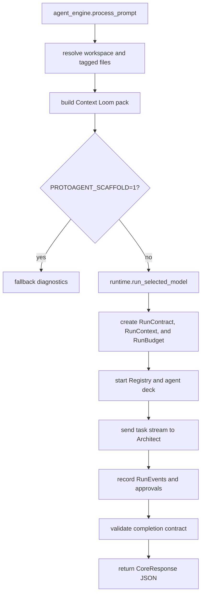

The Python core lives under `core/protoagent_core/`. It is the shared runtime
brain behind the Rust CLI and the planned ACP server.

The core is responsible for:

1. Provider config and redacted display state.
2. Model discovery and API key validation.
3. LLM construction through ProtoLink.
4. Context Loom indexing and prompt injection.
5. Agent deck assembly.
6. ProtoLink runtime startup, streaming, budgets, run reports, and tracing.
7. Typed approval and cancellation bridge.
8. ProtoLink conversation state inspection, compaction, reset, and persistence.
9. Workspace-safe read/search/diff/write helpers.

## Package Map

| Path | Responsibility |
| --- | --- |
| `agent_engine.py` | PyO3-facing JSON functions called by Rust. |
| `runtime.py` | Embedded ProtoLink mesh runner. |
| `runtime_bridge.py` | File-based progress, approval, and cancellation bridge. |
| `history.py` | ProtoLink-owned conversation state controls. |
| `llm.py` | Provider to ProtoLink LLM wiring and readiness checks. |
| `models.py` | Local/API model discovery and API key validation. |
| `config.py` | Provider config, API keys, context window settings. |
| `tools.py` | Workspace-safe deterministic tools. |
| `help_agent.py` | Isolated Guide agent for `/help QUESTION`. |
| `context/` | Context Loom indexer, SQLite store, packer, schemas. |
| `agents/` | Architect, Explorer, Coder factories and deck assembly. |

## Core Contract With Rust

Rust imports `protoagent_core.agent_engine` and calls functions that return JSON
strings. The CLI parses those strings into Rust structs such as `CoreResponse`,
`ModelInventory`, `VisibleConfig`, and `DoctorReport`.

This keeps the boundary stable and debuggable:

```text
Rust command or TUI action
  -> PyO3 call
  -> Python core function
  -> JSON string
  -> Rust display state
```

## Core Contract With ProtoLink

ProtoAgent intentionally uses ProtoLink as the runtime engine. Important
ProtoLink objects used by the core include:

| ProtoLink object | How ProtoAgent uses it |
| --- | --- |
| `Agent` | Architect, Explorer, Coder, Guide, and state-control facades. |
| `Registry` | Agent discovery for Architect delegation. |
| `AgentClient` | Send tasks, stream task events, cancel tasks. |
| `Task` | User requests and final responses. |
| `RunContext` | Session id, workspace URI, permissions, budget, metadata, trace id. |
| `RunBudget` | Runtime limits from environment and provider config. |
| `RunRecorder` | Normalized runtime event collection. |
| `RunEvent` | Stable UI trace/timeline input. |
| `RunReport` | Redacted durable run report returned to Rust. |
| `RunAction` | Workspace write proposal with preview artifacts. |
| `CapabilityPolicy` | Deny-by-default tool and action permissions. |
| `ApprovalRequest` | Policy pause before write execution. |
| `ApprovalDecision` | Human decision from the Rust app. |
| `TaskCancellationRequest` | Live cancellation from the TUI. |
| `ConversationState` | Durable Architect memory and state-control facades. |
| `RunContract` | ProtoAgent task contract attached to `RunContext.metadata`. |

## Primary Flow



## Tests

The core tests focus on runtime contracts rather than only prompt text:

| Test file | Coverage |
| --- | --- |
| `core/tests/test_runtime_integration.py` | Policies, approvals, cancellation, streaming, run budgets, event/report behavior. |
| `core/tests/test_history_integration.py` | ProtoLink conversation state describe, compact, reset, and top-level turn persistence. |
| `core/tests/test_run_contracts.py` | Task contract inference and completion validation. |
| `core/tests/test_agent_manifest.py` | Runtime architecture manifest exposed to CLI diagnostics. |
| `core/tests/test_llm_context.py` | Ollama context window, metrics profile, runtime prompt budget, context continuity ownership. |
| `core/tests/test_help_agent.py` | Guide isolation, no tools/storage, current settings snapshot. |

Run them with:

```bash
PYTHONPATH=core .venv/bin/python -m unittest discover core/tests
```
