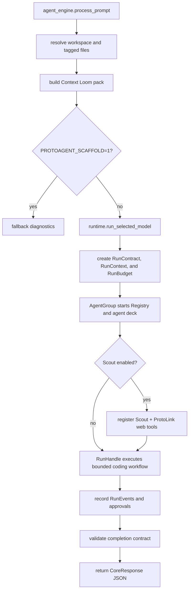

The Python core lives under `core/protoagent_core/`. It is the shared runtime
brain behind the Rust CLI and the planned ACP server.

The active core package version is `0.2.3`. It is declared in
`core/pyproject.toml` and exported as `protoagent_core.__version__`.

The core is responsible for:

1. Provider config and redacted display state.
2. Model discovery and API key validation.
3. LLM construction through ProtoLink.
4. Context Loom indexing and prompt injection.
5. Agent deck assembly, including opt-in Scout registration.
6. Configure native lifecycle, streaming, budgets, run reports, and tracing.
7. Typed approval and cancellation bridge.
8. ProtoLink conversation state inspection, compaction, reset, and persistence.
9. Workspace read/search helpers and native recoverable file tool registration.
10. Optional ProtoLink web-search/fetch wiring with an explicit network boundary.

## Package Map

| Path | Responsibility |
| --- | --- |
| `agent_engine.py` | PyO3-facing JSON functions called by Rust. |
| `_version.py` | Core version, ACP development marker lookup, and component inventory helpers. |
| `runtime.py` | Embedded ProtoLink mesh runner. |
| `runtime_bridge.py` | File-based progress, approval, and cancellation bridge. |
| `runtime_policy.py` | Trusted authorization scope, workspace policy, edit/check phases. |
| `runtime_storage.py` | Credential selection and terminal sanitization for native redaction. |
| `streaming.py` | Native model/process events projected into provisional UI output. |
| `workflow.py` | Native Graph with bounded coding and repair attempts. |
| `verification.py` | Application acceptance through native completion checks. |
| `checkpoints.py` | Private native checkpoint storage, project lease and inventory. |
| `history.py` | ProtoLink-owned conversation state controls. |
| `llm.py` | Provider to ProtoLink LLM wiring and readiness checks. |
| `models.py` | Local/API model discovery and API key validation. |
| `config.py` | Provider config, API keys, context window, prompt profile, and optional-agent settings. |
| `tools.py` | Workspace-safe deterministic tools. |
| `help_agent.py` | Isolated Guide agent for `/help QUESTION`. |
| `context/` | Context Loom indexer, SQLite store, packer, schemas. |
| `agents/` | Architect, Explorer, Coder, Verifier, optional Scout factories, and deck assembly. |

## Core Contract With Rust

Rust imports `protoagent_core.agent_engine` and calls functions that return JSON
strings. The CLI parses those strings into Rust structs such as `CoreResponse`,
`ModelInventory`, `VisibleConfig`, and `DoctorReport`.

This keeps the boundary stable and debuggable:

```text
Rust command or TUI action
  -> PyO3 call
  -> Python core function
  -> JSON string
  -> Rust display state
```

## Core Contract With ProtoLink

ProtoAgent intentionally uses ProtoLink as the runtime engine. Important
ProtoLink objects used by the core include:

| ProtoLink object | How ProtoAgent uses it |
| --- | --- |
| `Agent` | Architect, Explorer, Coder, Verifier, optional Scout, Guide, and state-control facades. |
| `AgentGroup` | Owned agents, readiness, cleanup and explicitly external resources. |
| `Registry` | Agent discovery for Architect delegation. |
| `AgentClient` | Native delegation between agents over the configured transport. |
| `RunHandle` / `RunResult` | Typed events, live cancellation and normalized final results. |
| `Task` | User requests and final responses. |
| `RunContext` | Session id, workspace URI, permissions, budget, metadata, trace id. |
| `RunBudget` | Runtime limits from environment and provider config. |
| `RunRecorder` | Normalized runtime event collection. |
| `RunEvent` | Stable UI trace/timeline input. |
| `RunReport` | Redacted durable run report returned to Rust. |
| `RunAction` | Exact prepared commands and file changes with native preview artifacts. |
| `CapabilityPolicy` | Deny-by-default tool and action permissions. |
| `ApprovalBroker` / `ApprovalScope` | Scoped pending requests, correlated decisions and cancellation. |
| `ApprovalRequest` | Policy pause before command execution, file writes or restoration. |
| `ApprovalDecision` | Human decision from the Rust app. |
| `StorageCheckpointStore` | Dedicated SQLite-backed native file recovery records. |
| `CompletionCheck` / `CompletionValidator` | Executed outcomes and revision-dependent acceptance. |
| `Graph` | One initial attempt and at most two bounded repair attempts. |
| `ConversationState` | Durable Architect memory and state-control facades. |
| `Tool` | First-party agent tools, including Scout's bounded `web_search` and `fetch_url`. |

`RunContract` is a ProtoAgent application contract defined in
`run_contracts.py`; it is serialized into `RunContext.metadata`. It is not a
ProtoLink public object. This separation is deliberate: ProtoLink enforces
generic runtime behavior while ProtoAgent decides what counts as a completed
coding task.

## Primary Flow



## Tests

The core tests focus on runtime contracts rather than only prompt text:

| Test file | Coverage |
| --- | --- |
| `core/tests/test_runtime_integration.py` | Policies, approvals, cancellation, streaming, run budgets, event/report behavior. |
| `core/tests/test_native_runtime.py` | Real native tools, broker correlation, runtime/SSE meshes, uncertainty and bounded repairs without paid models. |
| `core/tests/test_verification.py` | Native process outcomes, resource revisions and completion evidence. |
| `core/tests/test_checkpoints.py` | Private storage, native restoration, conflicts and legacy inspection. |
| `core/tests/test_history_integration.py` | ProtoLink conversation state describe, compact, reset, and top-level turn persistence. |
| `core/tests/test_run_contracts.py` | Task contract inference and expected evidence. |
| `core/tests/test_context_indexer.py` | Incremental index refresh and unchanged-file accounting. |
| `core/tests/test_agent_manifest.py` | Runtime architecture manifest exposed to CLI diagnostics. |
| `core/tests/test_llm_context.py` | Ollama context window, metrics profile, runtime prompt budget, context continuity ownership. |
| `core/tests/test_help_agent.py` | Guide isolation, no tools/storage, current settings snapshot. |

Run them with:

```bash
PYTHONPATH=core .venv/bin/python -m unittest discover core/tests
```
