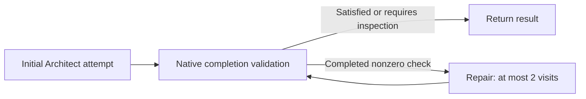

ProtoAgent 0.2.3 requires **ProtoLink 0.7.1**. `runtime.py` configures an embedded
mesh; `workflow.py` defines coding acceptance and repair routing. Native agents,
tools, policies, budgets, storage and cancellation execute the work.

## Entry and ownership

```python
run_selected_model(prompt, workspace=None, session_id=None, progress_path=None, user_prompt=None)
```

The application loads model configuration, builds a trusted `RunContext`, leases
the project's checkpoint namespace, and constructs its agents. Each LLM-capable
role gets its own configured LLM instance. Verifier and optional Scout have no
LLM. Architect retains its conversation state; workers remain task-local.

| Native object | Application configuration |
| --- | --- |
| `AgentGroup` | Owns the Registry and enabled mesh agents; readiness, partial-start rollback and shutdown are native. |
| Second `AgentGroup` | Owns a local workflow controller, declaring the running mesh as external resources. |
| `RunHandle` | Executes the workflow and Architect attempts; supplies typed events, cancellation, normalized `RunResult` and `RunReport`. |
| `ApprovalBroker` | Actual approval handler on Coder/Verifier, with per-run durable records and expiration. |
| `StorageCheckpointStore` | Dedicated per-project `SQLiteStorage` namespace under `recovery/`. |
| `SQLiteRunStore` | Native task/report persistence in a private per-run database under `runs/`. |
| `Graph` | One initial attempt, two repair visits, three acceptance visits, seven total visits maximum. |
| `CompletionValidator` | Application predicates over native execution receipts and resource revisions. |

The tool-only workflow controller exposes an application `run_workflow` tool to
its local handle. It has no model and is not advertised in worker discovery.
There is no application subprocess launcher or transport-final-event parser.

## Bounded application workflow



Architect receives repository context and delegates through normal ProtoLink
`agent_call` execution. All edits precede command checks within one attempt.
The application policy prevents further file changes after checking starts.
Only Graph dispatch opens a new repair attempt. Graph limits and shared native
budgets bound repair work independently of `RetryPolicy`.

`run_contracts.py` classifies the original prompt. Write contracts require a
native applied-file receipt at its current revision; verification requests
require executed commands. Approval, previews, delegation and blocker prose
cannot satisfy execution checks. Structured denials and blockers are preserved
as unsuccessful outcomes. A write without any command is explicitly unverified.

Command acceptance records the revisions of this run's changed files at
preparation and rechecks them through `CompletionCheck.read_revision`. It detects
later changes to those resources, including external edits. It does not capture
all repository inputs. See [Verify & Recover](../cli/verification-and-recovery.md)
for the exact acceptance and restoration boundaries.

## Authorization and controls

The top-level context grants `agent.delegate`, `workspace.read`,
`filesystem.read`, `filesystem.write`, `filesystem.restore`, `process.execute`
and `network.read`. Each agent still applies a restrictive native capability
policy. Coder requires approval for writes and restoration; Verifier requires
approval for command execution. Native policies otherwise allow actions by
default, so these requirements are explicitly configured.

`RunAuthorization` admits descendant run IDs from this owned, API-key-authenticated
mesh's trace and workspace. It constructs `ApprovalScope` server-side.
`RuntimeBridge` presents one pending broker request at a time and resolves the
exact request ID and prepared-action fingerprint. UI JSON cannot enlarge the
scope. Multiple pending requests remain in the broker. Malformed or stale
decisions do not release execution. Cancellation is sent once to `RunHandle`;
the application does not retry task submission to recover an uncertain effect.

Controls use short-lived private files shared with Rust. Without an interactive
bridge, pending approvals are denied. The per-run broker namespace has one live
writer; reopening stored pending records is inspection-only uncertainty, never
execution resumption.

## Transports and events

The mesh defaults to loopback SSE with an HTTP Registry. Set
`PROTOAGENT_AGENT_TRANSPORT=http`, `websocket`, `grpc` or `runtime` as needed.
The `grpc` transport requires ProtoLink's optional extra. `runtime` uses an
in-process Registry and transport identities. JSON-RPC aliases map to SSE.

`PROTOAGENT_RUNTIME_HOST` defaults to `127.0.0.1`. Registry and worker URLs can
be overridden with `PROTOAGENT_REGISTRY_URL`, `PROTOAGENT_ARCHITECT_URL`,
`PROTOAGENT_EXPLORER_URL`, `PROTOAGENT_CODER_URL`, `PROTOAGENT_VERIFIER_URL` and
`PROTOAGENT_SCOUT_URL`; the corresponding older `*_AGENT_URL` aliases remain.
The entry handle invokes owned agents locally; there is no separate CLI task
client to configure.

All deck agents advertise streaming. ProtoLink handles provider streaming,
delegated event propagation and final-result normalization. `streaming.py`
projects `llm_chunk`, `llm_final` and `process.output` into a separate live-output
channel for Rust. The TUI retains up to four stream previews, each with the last
4096 characters; shell output is flushed as deltas arrive. Task/agent/step/channel
identities keep independent streams separate. `llm_final` replaces its TUI
preview, while the native terminal task determines the overall run status.

JSON-action models produce raw JSON generation fragments. Native-tool models
produce ordinary text. The application displays both as provisional output and
does not parse partial actions or execute anything from the preview.

`PROTOAGENT_STREAM_TRACE_LIMIT` (default 120) limits summaries, not live text.
`PROTOAGENT_STREAM=0` suppresses live text and incremental UI summaries; native
handles still consume execution once. Peer capabilities determine whether
delegated output arrives live or with the final snapshot. Even an HTTP worker
mesh can show live output from the locally invoked Architect.

ProtoLink 0.7.1 puts delegated events and receipts directly in parent streams,
tasks and reports, with native identity preservation and deduplication. Completion
uses `RunReport.from_task()` on the native Graph task. Each attempt carries its
handle's complete report events into the Graph task, preserving model metrics
and stream events along with execution receipts. No stored-task scan or
application event join is needed, and a worker's terminal event cannot finish
the parent run.

Responses retain native transport diagnostics for the Registry and each worker.
The final report keeps the handle's normalized terminal task plus application
status, completion validation and verification metadata. Failed and uncertain
results remain failed and uncertain in the CLI. Errors after submission are
reported as potentially effected work, never as an action that was not submitted.

## Budgets and persistence

| Environment variable | Native budget |
| --- | --- |
| `PROTOAGENT_RUN_MAX_STEPS` | `max_steps`; application default 80 |
| `PROTOAGENT_RUN_MAX_LLM_CALLS` | `max_llm_calls` |
| `PROTOAGENT_RUN_MAX_TOOL_CALLS` | `max_tool_calls`; application default 80 |
| `PROTOAGENT_RUN_MAX_SECONDS` | `max_runtime_seconds`; default agent timeout, 600 seconds |
| `PROTOAGENT_RUN_MAX_INPUT_TOKENS` | Aggregate `max_input_tokens` for all providers, including Ollama |
| `PROTOAGENT_RUN_MAX_OUTPUT_TOKENS` | `max_output_tokens` |

Input and output token budgets are optional totals across model calls in a run.
They are unset unless explicitly configured. A model's context window applies to
individual requests and does not set the aggregate run budget. Command execution
is also bounded by its explicit limits and the remaining native runtime budget.
Native nested flows share budgets; remote workers enforce inherited limits.

`SQLiteRunStore(..., redaction_policy=...)` applies native redaction before every
task, report and caller metadata write. Known credential values use native
`RedactionPolicy.sensitive_values`; default sensitive keys include recovery
`data_base64`. ProtoAgent selects credentials and adds terminal-control stripping.
The complete recovery and approval records live only in protected storage.
RunReplay remains read-only inspection, not task resumption.

`PROTOAGENT_TRACE=1` enables native `LocalTraceTelemetry` at
`${PROTOAGENT_CONFIG_DIR:-~/.protoagent}/traces.jsonl`, using the same redactor.
Private directories use 0700 and storage files use 0600. Source diffs and unknown
secrets printed by project code can still be sensitive.
