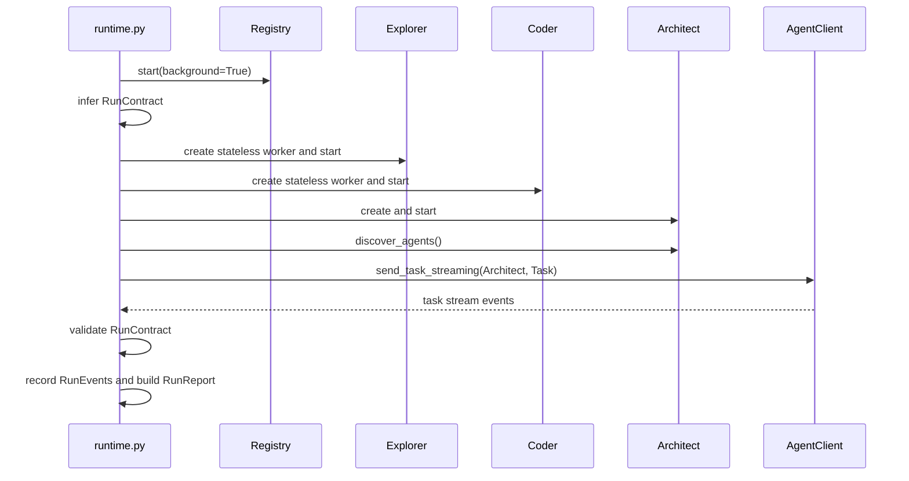

`runtime.py` starts the local ProtoLink mesh for a single run. It is the main
runtime integration point between ProtoAgent and ProtoLink.

## Entry Point

```python
run_selected_model(prompt, workspace=None, session_id=None, progress_path=None, user_prompt=None)
```

Steps:

1. Load config and selected provider/model.
2. Create a `RuntimeBridge` for progress, approvals, and cancellation.
3. Run `_run_agent_deck()` in an asyncio event loop.
4. Clean up bridge control files.

If no model is selected for the active provider, runtime startup raises an
error and `agent_engine.process_prompt()` returns fallback diagnostics.

## Runtime Objects

Inside `_run_agent_deck()`:

| Object | Purpose |
| --- | --- |
| `Registry` | Local HTTP registry used for agent discovery. |
| `AgentClient` | Sends task to Architect and streams events. |
| `Task` | User request task. |
| `RunContext` | Session id, workspace URI, permissions, budget, metadata, run id, trace id. |
| `RunBudget` | Typed runtime budget from environment/provider settings. |
| `RunContract` | Task kind, required workers, required write artifacts, and completion rule derived from the original user prompt. |
| `RunRecorder` | Captures normalized `RunEvent`s and builds a redacted `RunReport`. |
| `RuntimeBridge` | Emits CLI progress, handles approvals, watches cancellation. |

## Run Contracts

`run_contracts.py` derives a contract before the model receives the prompt.
Runtime attaches it to:

```python
RunContext.metadata["run_contract"]
```

Read-only repository questions do not require write artifacts. Workspace-change
tasks require one of these terminal signals:

1. Coder delegation in the normalized run events.
2. A write approval request or diff preview artifact.
3. An explicit blocker in the model answer.

After Architect returns, runtime calls `validate_run_completion()`. If a write
task ended as prose without Coder, approval/diff artifacts, or blocker, the
runtime changes the status to `incomplete` and prefixes the answer with a
completion-guard message.

## RunContext Permissions

The top-level run context grants app-level permissions:

| Permission | Effect |
| --- | --- |
| `agent.delegate` | allow |
| `workspace.read` | allow |
| `workspace.write` | allow |

Agent-specific `CapabilityPolicy` still applies. Coder's `workspace.write`
policy requires approval even though the top-level context permits the category.

## URLs And Transports

The runtime resolves URLs for Registry, client, Architect, Explorer, and Coder.
By default it binds free localhost ports.

Environment overrides:

| Variable | Purpose |
| --- | --- |
| `PROTOAGENT_RUNTIME_HOST` | Host used for generated local URLs. Defaults to `127.0.0.1`. |
| `PROTOAGENT_REGISTRY_URL` or `REGISTRY_URL` | Registry URL override. |
| `PROTOAGENT_CLIENT_URL` or `CLIENT_URL` | Client URL override. |
| `PROTOAGENT_ARCHITECT_URL` or `ARCHITECT_AGENT_URL` | Architect URL override. |
| `PROTOAGENT_EXPLORER_URL` or `EXPLORER_AGENT_URL` | Explorer URL override. |
| `PROTOAGENT_CODER_URL` or `CODER_AGENT_URL` | Coder URL override. |

Agent transport:

```bash
PROTOAGENT_AGENT_TRANSPORT=sse
PROTOAGENT_AGENT_TRANSPORT=http
```

Aliases such as `jsonrpc`, `json-rpc`, `sse-jsonrpc`, and `sse-json-rpc` map to
`sse`.

ProtoAgent constructs concrete transports through ProtoLink's shared
`TransportConfig` contract. ProtoLink therefore owns payload and concurrency
limits, idempotency, lifecycle health, shutdown, capabilities, and operational
metrics for the Registry, each agent, and the CLI-side `AgentClient`. The core
does not maintain a parallel retry, health, or transport-metrics layer.

ProtoLink 0.6.5 also accepts `grpc` when the separate `protolink[grpc]` extra is
installed. It remains opt-in rather than adding `grpcio` to every local CLI
installation. TLS and multi-interface agent metadata are likewise left to
networked deployments because ProtoAgent's embedded mesh uses loopback
HTTP/SSE by default.

Streaming can be disabled independently:

```bash
PROTOAGENT_STREAM=0
```

## Startup Sequence



## Streaming Event Handling

`_send_task_streaming()` consumes `AgentClient.send_task_streaming()`.

It suppresses raw token chunks, records useful events with `RunRecorder`, emits
summary rows to the Rust progress bridge, and extracts final content from:

1. Final task metadata.
2. Final LLM stream content.
3. Artifact content fallback.

If streaming is unavailable for a transport, runtime falls back to one-shot
`send_task()`.

Each completed core response includes a `transport_report` containing the
first-party configuration, capabilities, and `TransportMetricsSnapshot` for
the Registry, client, Architect, Explorer, and Coder transports. The shell CLI
summarizes client request, stream, retry, and byte counters; the TUI keeps the
full report in response details.

## Run Reports

After delivery, runtime builds a redacted `RunReport`:

```python
recorder.to_report(
    context=final_context,
    final_task=final_task,
    metadata={
        "application": "protoagent",
        "interface": "rust-cli",
        "provider": provider,
        "model": model,
    },
)
```

Rust stores this in `CoreResponse.run_report` so users can inspect structured
diagnostics. `CoreResponse.status` can be `answered`, `blocked`, `canceled`, or
`incomplete`.

## Run Budgets

Environment variables populate `RunBudget`:

| Variable | Budget field |
| --- | --- |
| `PROTOAGENT_RUN_MAX_STEPS` | `max_steps` |
| `PROTOAGENT_RUN_MAX_LLM_CALLS` | `max_llm_calls` |
| `PROTOAGENT_RUN_MAX_TOOL_CALLS` | `max_tool_calls` |
| `PROTOAGENT_RUN_MAX_SECONDS` | `max_runtime_seconds` |
| `PROTOAGENT_RUN_MAX_INPUT_TOKENS` | `max_input_tokens` |
| `PROTOAGENT_RUN_MAX_OUTPUT_TOKENS` | `max_output_tokens` |

For Ollama, `max_input_tokens` comes from the effective Ollama context window.
For other providers, it comes from the environment or provider config.

## Local Trace Telemetry

Enable ProtoLink local trace telemetry:

```bash
PROTOAGENT_TRACE=1 proto-cli run "task"
```

Trace file:

```text
~/.protoagent/traces.jsonl
```

or:

```text
${PROTOAGENT_CONFIG_DIR}/traces.jsonl
```

## Cancellation

The runtime starts `_monitor_cancellation()` while the task is active. It polls
the bridge's cancel file and sends a `TaskCancellationRequest`:

1. First to the in-process Architect agent, if available.
2. Then through `AgentClient.cancel_task()`.

The preflight cancellation path handles the case where the user cancels before
agent startup finishes. It cancels the `RunContext` and `Task`, then returns a
normal canceled result.
