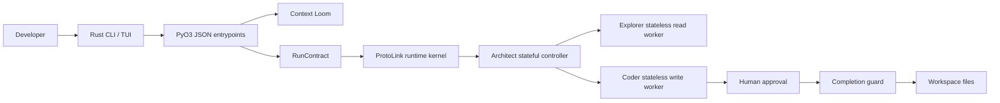

ProtoAgent is a local-first agent ecosystem for autonomous coding. The repo is
organized around one core idea: keep the agent brain in the Python core, keep
frontends thin, and let ProtoLink own the runtime contracts for agents, events,
state, actions, and approvals.

The current monorepo has three main product surfaces:

| Surface | Path | Version | Status | Responsibility |
| --- | --- | --- | --- | --- |
| Rust CLI and TUI | `cli/` | `0.1.0` | Active | Terminal UX, project selection, model setup, live progress, approvals, cancellation, traces, sessions. |
| Python core | `core/protoagent_core/` | `0.1.0` | Active | ProtoLink agent deck, model/provider wiring, Context Loom, config, history, tools, runtime bridge. |
| ACP server | `acp/` | `0.0.0-dev.0` | Planned | Editor-facing Agent Client Protocol server. Current docs mark implementation details as TBD. |

The rest of the repo supports those surfaces:

| Path | Purpose |
| --- | --- |
| `whitepaper.md` | Architecture thesis for local-first Agent-to-Agent orchestration. |
| `playground/` | Small sample apps used as coding-agent targets and integration sandboxes. |
| `misc/assets/` | Images and CLI demos used by README and docs. |

## Design Principles

ProtoAgent is not a single giant prompt wrapped in a terminal. The system is
split into small, inspectable components:

1. **Frontends stay product-specific.** The CLI owns terminal interaction,
   panels, modal flows, input history, and approval UX.
2. **The Python core owns app logic.** Provider discovery, config, Context Loom,
   runtime startup, and the agent deck live under `core/protoagent_core/`.
3. **ProtoLink owns runtime semantics.** Runs use `RunContext`, `RunBudget`,
   `RunEvent`, `RunReport`, typed actions, capability policies, state APIs,
   streaming task channels, and cancellation requests.
4. **Context is visible.** Context Loom builds a deterministic, source-cited
   evidence pack before the model reasons.
5. **State is deliberate.** Architect keeps durable conversation memory, while
   Explorer and Coder are task-local stateless workers.
6. **Runs have contracts.** Write tasks must reach Coder, an approval/diff
   artifact, or an explicit blocker before runtime marks them complete.
7. **Writes are approval-gated.** Coder prepares `RunAction` objects with
   `text/x-diff` preview artifacts. The Rust application decides whether the
   action can execute.

## How These Docs Are Organized

These docs are intentionally modular. A future change should usually require
updating one page, not rewriting a manual.

| If you change... | Update... |
| --- | --- |
| A shell command or slash command | `CLI / Commands` |
| A TUI panel, modal, scrolling rule, or input behavior | `CLI / Fullscreen TUI` |
| Project config, sessions, or file tagging | `CLI / Projects and Sessions` |
| Provider discovery, API keys, or model selection | `CLI / Models and Config` and `Core / Config and Models` |
| Context Loom scoring, index schema, or prompt format | `CLI / Context Loom` and `Core / Context Loom` |
| Runtime transport, budgets, streaming, tracing, or cancellation | `Core / Runtime` and `Reference / Environment` |
| Component version source or release marker | `Reference / Versioning` |
| Agent prompts, tools, or policies | `Core / Agent Deck` and `Core / Safety and Tools` |
| Contributor tooling, linting, type-checking, or formatting | `Contributing / Development Workflow` and `Reference / Verification` |
| ACP implementation | `ACP / Plan` |

## Source Of Truth

The docs describe the code currently checked into this repo. When there is a
conflict, prefer the implementation and update the relevant doc page in the same
change.

Useful source entrypoints:

| Code | What to inspect |
| --- | --- |
| `cli/src/main.rs` | Shell command routing, PyO3 calls, context commands, config paths. |
| `cli/src/terminal_ui.rs` | Fullscreen TUI command dispatcher and task loop. |
| `cli/src/terminal_ui/` | Focused TUI modules for render, modals, project picker, model picker, approvals, diff review. |
| `cli/src/progress.rs` | Live JSONL progress tailing, approval decision files, context meter samples. |
| `cli/src/timeline.rs` | Normalized `RunEvent` trace and timeline formatting. |
| `cli/src/sessions.rs` | Rust UI session ledger. |
| `core/protoagent_core/agent_engine.py` | PyO3-facing functions called by Rust. |
| `core/protoagent_core/runtime.py` | ProtoLink runtime mesh startup and streaming execution. |
| `core/protoagent_core/agents/` | Architect, Explorer, Coder, and deck assembly. |
| `core/protoagent_core/context/` | Context Loom index, SQLite store, pack builder, schemas. |
| `core/protoagent_core/history.py` | ProtoLink state describe, compact, reset, and persistence helpers. |
| `core/protoagent_core/tools.py` | Workspace-safe read, search, diff preview, and writes. |
| `pyproject.toml` | Ruff and ty configuration for the Python surface. |
| `core/pyproject.toml` | Python core package metadata and core release version. |
| `VERSIONING.md` | Component version policy and source-of-truth map. |
| `rustfmt.toml` | Rust formatting configuration for the CLI crate. |
| `CONTRIBUTING.md` | GitHub-facing contributor setup and pull request workflow. |
