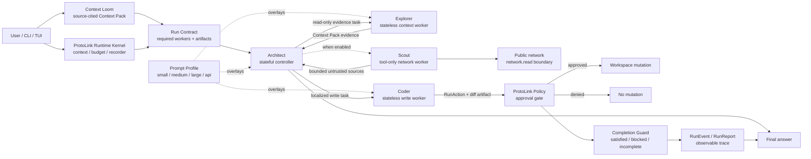

# ProtoAgent Architecture: Local-First A2A Orchestration for Autonomous Coding

**Abstract** Many coding agents assume a frontier model, a large context window,
and one model-facing surface with broad tool access. ProtoAgent explores a
different architecture: a local-first Agent-to-Agent ($A2A$) coding system
powered by ProtoLink. It separates a stateful controller from narrow stateless
workers, feeds each task through deterministic local context, and adapts prompts
to the active model's capability class. Optional public-web research is isolated
behind a tool-only Scout agent and an explicit network boundary. The result is a
runtime that can make smaller local models more reliable without changing the
approval and capability rules used for stronger API models.

---

## One: The Context Collapse Problem

Modern coding agents typically utilize a "God Prompt" architecture. A single large language model is given access to all tools (file reading, bash execution, code writing) and a massive system prompt detailing how to act as a software engineer.

While effective for frontier hosted models, this approach catastrophically fails when applied to local 7B-8B parameter models. Small models suffer from context collapse when overwhelmed by complex XML tags, multi-step instructions, and dozens of available tools. They hallucinate syntax, forget the original user request, or enter infinite tool-calling loops.

ProtoAgent solves this by abandoning the monolithic agent. Instead, it utilizes structured Agent-to-Agent ($A2A$) flows where multiple specialized agents are given highly restricted, single-purpose roles. The central thesis is simple: model intelligence should change the depth of reasoning, not the safety boundary. A small local model and a frontier API model should see different prompt overlays, but both should move through the same evidence, delegation, policy, and approval architecture.

---

## Two: The ProtoLink Engine: A2A Core

At the heart of the ecosystem is ProtoLink, the Python agent runtime used as
ProtoAgent's execution engine. The integration follows four principles:

* **Structured Delegation:** Agents delegate through ProtoLink task and `agent_call` semantics instead of unbounded conversational handoffs. The Architect remains the routing authority for normal coding workflows.
* **Tool Isolation:** An agent is only injected with the exact JSON Schema tools it needs for its specific role.
* **Structured Handoffs:** Agents communicate through typed tasks, actions, artifacts, and events, removing conversational "fluff" from the internal execution path.
* **Runtime Contracts:** ProtoAgent derives a task contract before the model runs, attaches it to `RunContext`, and validates the resulting trace before declaring the task complete.

---

## Three: Runtime Kernel And Worker Topology

To optimize execution speed and enforce cognitive guardrails on smaller models,
ProtoAgent separates stateful control from stateless specialist execution. The
developer still sees one assistant, but the runtime is split into a small set of
durable control surfaces and disposable worker roles.

### I. The ProtoLink Runtime Kernel

The runtime kernel is not another LLM persona. It is the non-LLM control plane
that owns `RunContext`, `RunBudget`, `RunRecorder`, policy checks, approval
requests, cancellation, redaction, trace events, and durable run reports. This
is where safety and observability live.

* **Role:** Execute the run protocol, enforce policy, preserve traceability, and
  keep durable runtime state out of worker prompts.
* **Runtime Surface:** `RunContext`, `RunBudget`, `RunAction`, `RunEvent`,
  `RunReport`, `CapabilityPolicy`, and the application approval bridge.
* **Logic:** A task is not complete merely because the model produced prose. The
  kernel checks the task contract against worker usage and artifacts.

### II. The Architect (Stateful Controller)

The Architect is the only LLM agent that keeps durable conversation memory. It
receives the user-facing task from the CLI, reads the current Context Loom pack,
and delegates to workers through ProtoLink discovery and `agent_call`.

* **Role:** Intent classification, task breakdown, and delegation.
* **Runtime Surface:** `protolink` registry discovery, `agent_call` delegation, `RunContext`, `RunEvent`, and policy-aware action authorization.
* **Logic:** It maintains the route and final answer but performs no file system
  operations itself. Because workers are stateless, its handoffs must include
  the objective, paths, evidence, and acceptance criteria needed for the
  current run.

### III. The Explorer (Stateless Context Worker)

Explorer is a task-local read-only worker. It has no durable conversation
memory. Each call starts from the current task, Context Loom evidence, and its
read-only tools.

* **Role:** Read-only repository exploration and context framing.
* **Tools:** `build_context_pack`, `read_file`, `list_directory`, `search_regex`, `get_git_status`.
* **Logic:** When the Architect needs repository ground truth, it dispatches
  Explorer with a focused question. Explorer returns compact, source-cited
  evidence for the current run and then disappears.

### IV. Scout (Optional Tool-Only Network Worker)

Scout is not another reasoning persona. It is a registered ProtoLink agent with
`llm=None`, no durable storage, no enabled conversation state, and no chat
surface. It is disabled by default, and therefore absent from discovery during
normal offline-oriented runs.

* **Role:** Expose bounded public-web evidence without giving Explorer or Coder
  ambient network access.
* **Tools:** ProtoLink 0.6.6 `web_search` and `fetch_url`, both declaring
  `network.read`.
* **Logic:** When enabled, Architect discovers Scout and invokes one of its
  tools directly. Brave search uses `BRAVE_SEARCH_API_KEY`; DuckDuckGo is
  keyless best-effort search, and English Wikipedia is keyless factual search.
  URL fetches reject private
  and loopback targets, unsafe redirects, binary bodies, and oversized
  responses. All returned content is marked untrusted.

This isolation matters for smaller models: web schemas and noisy external text
do not occupy the default deck, and public content never enters the workspace
write boundary merely because it was retrieved.

### V. The Coder (Stateless Write Worker)

Coder is a task-local write worker. It does not keep durable memory and does not
receive Explorer's broad read/search tools. It receives a localized objective
and enough evidence to prepare a patch.

* **Role:** Synthesize code and generate file modifications.
* **Tools:** `generate_unified_diff`, `create_new_file`.
* **Logic:** The Architect hands the Coder the user objective and bounded
  Context Pack evidence. The Coder prepares `RunAction` write operations with
  unified-diff preview artifacts, so policy and approval happen before files are
  modified.

This split is the core design move: **stateful controller, narrow stateless or
tool-only workers, typed artifacts, and runtime completion checks**. The
architecture can grow by
adding more workers, such as Test Locator, Patch Planner, Review Worker, or
Verification Planner, without giving every role durable memory or every tool.

---

## Four: Run Contracts And Completion Guards

Before the model runs, ProtoAgent derives a small **Run Contract** from the
original user request. The contract is attached to `RunContext.metadata` and
becomes part of the observable trace.

For a read-only repository question, the contract may expect evidence but no
write artifact. For a workspace-change task, the contract requires the run to
reach one of three terminal conditions:

1. Coder delegation happened.
2. A `RunAction` approval request or diff preview artifact exists.
3. The model reported an explicit blocker.

If a write task ends in prose without Coder, approval, diff, or blocker,
ProtoAgent marks the run as `incomplete`. This is deliberately outside the
prompt. The model can suggest a route, but the runtime decides whether the route
satisfied the contract.

Example contract:

```json
{
  "task_kind": "workspace-change",
  "requires_explorer": true,
  "requires_coder": true,
  "requires_write": true,
  "expected_workers": ["explorer", "coder"],
  "expected_artifacts": ["approval_request", "diff_preview"],
  "completion_rule": "Workspace changes must reach Coder, a write approval/diff preview, or an explicit blocker before the run is terminal."
}
```

---

## Five: Context Loom (The Local Context Fabric)

The missing layer in most local coding agents is not another chat prompt. It is
a deterministic context substrate that can decide what a small model should see
before the model is asked to reason. ProtoAgent calls this substrate **Context
Loom**.

Context Loom is a local, inspectable workspace intelligence layer. It indexes
the active project into a compact code graph made of files, symbols, imports,
documentation headings, fingerprints, and git state. At task time, it does not
dump the repository into the context window. It weaves a bounded
**Context Pack**: a source-cited packet of evidence that the Architect, Explorer,
and Coder can consume through normal `protolink` task flow.

This differs from two common industry patterns:

* **Monolithic context loading:** large cloud agents often rely on enormous
  context windows and implicit repository awareness. This can work with frontier
  models, but it is expensive, opaque, and brittle for local models.
* **Pure tool wandering:** shell-first agents repeatedly call file and search
  tools to discover context from scratch. This is transparent, but it burns
  steps and can leave smaller models stuck in exploration loops.

Context Loom combines the strengths of both approaches. It gives the system a
local memory of the workspace, but every included file and snippet carries an
explicit reason. A Context Pack is intentionally small enough for 7B-8B models,
yet rich enough to preserve the engineering facts that matter.

Refresh is incremental. The indexer compares each candidate file's stored size
and modification time before opening it. Unchanged files are not reread,
reparsed, hashed, or upserted; changed/new files are processed and stale paths
are removed. This keeps automatic per-prompt refresh affordable without making
the model reason about cache invalidation.

Technically, Context Loom is built around four primitives:

1. **Project Index:** a local SQLite index for text files, language hints,
   symbols, imports, headings, content fingerprints, and update timestamps.
2. **Context Graph:** a deterministic relationship map linking files to the
   symbols they define, dependencies they import, docs they expose, tests they
   imply, and recent git changes.
3. **Context Pack:** a bounded, task-specific evidence packet containing
   relevant files, short line-numbered snippets, symbols, dependency hints,
   git status, and inclusion reasons.
4. **Evidence Ledger:** a human-readable explanation of why each item was
   selected, visible from the CLI and replayable in the agent trace.

The Context Pack format is deliberately structured:

```json
{
  "name": "Context Loom",
  "query": "Refactor the runtime task stream handling",
  "items": [
    {
      "path": "core/protoagent_core/runtime.py",
      "role": "runtime mesh",
      "reason": "path and symbol match for streaming task dispatch",
      "symbols": ["run_selected_model", "_send_task_streaming"],
      "line_range": "109-132",
      "snippet": "109 | task = Task.create_infer(prompt=prompt) ..."
    }
  ]
}
```

Because this is deterministic and local-first, it is compatible with small
models and privacy-preserving workflows. Because it is structured and
source-cited, it is also compatible with stronger models that can use the pack
as a high-signal scratchpad instead of re-discovering the repository every turn.

The strategic contribution is not "RAG for code." The contribution is
**visible context reasoning**: ProtoAgent can show the developer exactly what it
believes is relevant before it writes a diff. This makes local autonomous coding
auditable in a way that hidden embedding retrieval and giant context windows are
not.

## Six: Capability-Scaled Prompting

The core triad creates stable reasoning roles, while optional Scout adds a
tool-only network surface. Model capability still matters. A prompt
that helps a frontier API model reason carefully can overload a small local
model. A prompt short enough for a 7B model can underuse a strong long-context
model. ProtoAgent therefore treats prompting as a **capability lattice** rather
than a single universal instruction block.

The invariant layer is the role contract:

* Architect routes and coordinates as the stateful controller.
* Explorer gathers read-only evidence as a stateless worker.
* Coder prepares policy-gated modifications as a stateless worker.
* Scout, when explicitly enabled, exposes only `network.read` and has no LLM,
  workspace access, or memory.
* ProtoLink owns delegation, tools, memory, events, approvals, and runtime
  reports.
* Run Contracts define required workers and artifacts before the model answers.

On top of that invariant layer, ProtoAgent applies one of four prompt profiles:

| Profile | Intended model class | Prompting strategy |
| --- | --- | --- |
| `small` | 7B/8B and heavily quantized local models | Short instructions, one delegation at a time, narrow context, minimal public planning. |
| `medium` | Capable local or mid-tier models | Compact planning, evidence-backed assumptions, focused docs/tests guidance. |
| `large` | Strong local/cloud models | Multi-step decomposition, explicit acceptance criteria, deeper verification discipline. |
| `api` | Frontier hosted/API models | Senior-maintainer autonomy, adversarial self-checks, stronger expectations for tests, docs, and risk review. |

The important design choice is that prompt profiles are overlays, not separate
agent implementations. They tune reasoning budget, delegation cadence, evidence
requirements, and answer style while preserving the same tool permissions and
approval gates. This makes the system portable: a developer can move from a
small local model to an API-grade model without changing the topology or
trusting the model with broader ambient authority.

Prompt engineering best practices are encoded as architectural constraints:

1. **Role-specific instructions:** each agent receives only the responsibilities
   and tools it can execute.
2. **Capability-aware reasoning budget:** smaller models get short procedural
   steps; stronger models get acceptance criteria and verification loops.
3. **Evidence before mutation:** edits should flow from Context Loom and
   Explorer evidence into Coder, not from guesswork.
4. **No hidden authority expansion:** a stronger model may reason more deeply,
   but it does not bypass policy, approval, or workspace boundaries.
5. **Observable outcomes:** final responses summarize decisions, validation,
   changed paths, and residual risk without exposing hidden chain-of-thought.

In practice, `auto` can infer the profile from the active provider and model,
while explicit selection lets the user force a profile when they know more than
the heuristic. The CLI and TUI surface this through the agent configuration
interface, because prompt quality is part of the agent deck rather than a
separate model setting.

---

## Seven: System Graph

The complete theoretical control loop is:



This graph is deliberately asymmetric. The user sees one coherent assistant,
but the runtime preserves distinct responsibilities. Context is selected before
reasoning, a contract defines the required route, routing happens before
synthesis, synthesis produces an explicit action, and policy evaluates the
action before the workspace changes. Prompt profiles influence the quality of
reasoning inside the LLM-backed nodes, not the shape of the trust boundary
around them. Scout is not prompt-scaled reasoning; it is an optional capability
surface.

---

## Eight: Quality Evaluation Loop

Prompt engineering cannot be treated as prose alone. A professional agent needs
a regression surface for behavior, not just unit tests for code. ProtoAgent
therefore evaluates prompt profiles against fixed repository tasks that measure
whether the expected topology appears in the run.

The evaluation loop asks questions such as:

* Did a read-only task stay read-only?
* Did a change task route through Coder instead of letting Architect mutate?
* Did the run cite or touch the expected source, docs, or test paths?
* Did a write request reach ProtoLink's approval boundary?
* Did the runtime mark missing write artifacts as incomplete?
* Did the proposed edit stay within a reasonable file-count budget?
* Did external research remain disabled unless Scout was explicitly enabled?

This creates a feedback system for prompt work. If a `small` profile wanders
too much, the overlay can be shortened. If an `api` profile underuses tests or
docs, the overlay can be strengthened. If a model skips Explorer before Coder,
the scoring reveals a topology regression. The result is prompt engineering
that is measurable, repeatable, and tied to the same runtime events developers
already inspect.

The evaluation modes serve different levels of confidence:

| Mode | Purpose |
| --- | --- |
| `plan` | Show the profile/task matrix without model calls. |
| `scaffold` | Exercise prompt/context plumbing with no model call. |
| `live` | Run real models while keeping workspace writes behind auto-denied approvals. |

The strategic point is that ProtoAgent treats prompts as versioned runtime
assets. They have design intent, observable behavior, and regression tests. That
is what allows the system to become better over time without slipping back into
an opaque God Prompt.

---

## Nine: The Standard Execution Flow

When a user runs a command in the terminal (for example,
`proto-cli run "Extract the hardcoded strings in main.rs into a config file"`),
the following $A2A$ flow executes:

```
[User Input] -> [Context Loom] -> [Prompt Profile] -> [Architect]
       |              |
       v              v
 [Run Contract] -> [ProtoLink Runtime Kernel]
                                                        |
                    [Explorer verifies/expands] <-------|
                    [Scout web evidence, optional] <----|
                                                        |
[User Approval] <- [Approval Request] <- [Coder RunAction] <- Context Pack
                                                        |
                                                        v
                                              [Completion Guard]

```

1. **Intake:** The CLI receives the user prompt and asks Context Loom for an initial Context Pack.
2. **Weaving:** Context Loom incrementally refreshes the local index, scores
   files and symbols against the prompt, and records an Evidence Ledger for
   every included item.
3. **Contracting:** ProtoAgent derives a Run Contract from the original user prompt and attaches it to `RunContext.metadata`.
4. **Prompt Scaling:** ProtoAgent resolves the active prompt profile and attaches the role-specific overlay to Architect, Explorer, and Coder.
5. **Planning:** The stateful **Architect** receives the prompt plus the Context Pack and initializes the execution route.
6. **Contextualization:** The Architect delegates to the stateless **Explorer** only when more evidence is needed. Explorer can inspect the Context Pack, run read-only tools, and expand it through targeted file reads.
7. **Optional Research:** If Scout was explicitly enabled and current public
   evidence is needed, Architect invokes its bounded search/fetch tools and
   treats results as untrusted sources.
8. **Synthesis:** The Architect passes the localized task and compact evidence to the stateless **Coder**.
9. **Diff Generation:** The Coder prepares a strict unified-diff preview through a `RunAction` artifact.
10. **Policy & Approval:** ProtoLink evaluates the action capability, publishes a typed approval request with the preview artifact, and halts execution until ProtoAgent's frontend returns the human decision.
11. **Completion Guard:** Runtime validation checks the Run Contract against worker usage, approval requests, and diff artifacts before marking the task answered, blocked, incomplete, or canceled.

---

## Ten: Tool Abstraction And Network Trust

Because of strict tool isolation, ProtoAgent assigns capabilities to the
narrowest role that needs them. Repository reads stay with Explorer, public
network reads stay with optional Scout, and workspace writes stay with Coder
behind `RunAction` approval. Scout reuses ProtoLink's first-party web tools
instead of maintaining a parallel search/fetch implementation. Future external
tool protocols should preserve these same capability and approval boundaries
rather than granting broad ambient access to every agent.

---

## Eleven: Conclusion

By separating the stateful Architect from narrow specialist workers
(**Explorer**, **Coder**, and optional tool-only **Scout**), feeding coding work
through **Context Loom**, and validating every run against a **Run Contract**,
ProtoAgent creates an agentic coding system that is local-first, inspectable,
and model-portable. Smaller models receive less irrelevant context and fewer
tools; stronger models keep the same trust boundary. Context is cited, network
access is opt-in, actions are previewed, approvals are explicit, missing write
artifacts are marked incomplete, and prompt behavior can be evaluated over
time.
