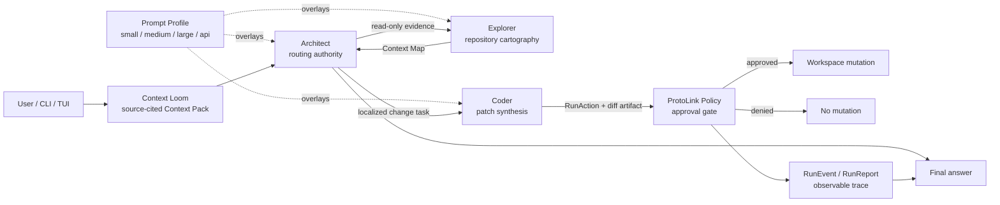

# ProtoAgent Architecture: Local-First A2A Orchestration for Autonomous Coding

**Abstract** As agentic coding transitions from experimental chat interfaces to autonomous, multi-step execution, the industry has heavily centralized around massive cloud inference models. Tools like Antigravity CLI, Claude Code, and Devin rely on monolithic context windows and heavy systemic routing that drain API token quotas rapidly during iterative loops. ProtoAgent proposes a radical alternative: a decentralized, Agent-to-Agent ($A2A$) orchestration architecture powered by the `protolink` engine. By breaking complex coding tasks into delegated sub-routines, feeding them through deterministic local context, and adapting prompts to the active model's capability class, ProtoAgent enables highly capable autonomous coding workflows on local hardware while still scaling cleanly to frontier API models.

---

## One: The Context Collapse Problem

Modern coding agents typically utilize a "God Prompt" architecture. A single large language model is given access to all tools (file reading, bash execution, code writing) and a massive system prompt detailing how to act as a software engineer.

While effective for frontier hosted models, this approach catastrophically fails when applied to local 7B-8B parameter models. Small models suffer from context collapse when overwhelmed by complex XML tags, multi-step instructions, and dozens of available tools. They hallucinate syntax, forget the original user request, or enter infinite tool-calling loops.

ProtoAgent solves this by abandoning the monolithic agent. Instead, it utilizes structured Agent-to-Agent ($A2A$) flows where multiple specialized agents are given highly restricted, single-purpose roles. The central thesis is simple: model intelligence should change the depth of reasoning, not the safety boundary. A small local model and a frontier API model should see different prompt overlays, but both should move through the same evidence, delegation, policy, and approval architecture.

---

## Two: The ProtoLink Engine: A2A Core

At the heart of the ecosystem is `protolink`, a minimalist Python orchestration layer designed explicitly for local model quirks. `protolink` operates on three core principles:

* **Structured Delegation:** Agents delegate through `protolink` task and `agent_call` semantics instead of unbounded conversational handoffs. The Architect remains the routing authority for normal coding workflows.
* **Tool Isolation:** An agent is only injected with the exact JSON Schema tools it needs for its specific role.
* **Structured Handoffs:** Agents communicate through typed tasks, actions, artifacts, and events, removing conversational "fluff" from the internal execution path.

---

## Three: The ProtoAgent Triad (Agent Topology)

To optimize execution speed and enforce cognitive guardrails on smaller models, ProtoAgent separates core responsibilities into a three-node topology.

### I. The Architect (The Orchestrator)

The Architect is the brain of the operation. It is the only agent that speaks directly to the user through ProtoAgent's frontends.

* **Role:** Intent classification, task breakdown, and delegation.
* **Runtime Surface:** `protolink` registry discovery, `agent_call` delegation, `RunContext`, `RunEvent`, and policy-aware action authorization.
* **Logic:** It receives the raw user prompt, decomposes it into a sequential execution plan, and dispatches specialized nodes. It maintains the task route but performs no file system operations itself.

### II. The Explorer (Context & Cartography)

Coding requires high-fidelity context. The Explorer acts as the eyes and scouts of the system.

* **Role:** Read-only repository exploration and context framing.
* **Tools:** `build_context_pack`, `read_file`, `list_directory`, `search_regex`, `get_git_status`.
* **Logic:** When the Architect needs to understand a codebase, it dispatches the Explorer. The Explorer aggressively scans the filesystem, reads relevant files, and compiles a dense, markdown-formatted **Context Map**. By isolating search and reading to this agent, we prevent the code-generating agent from wasting reasoning cycles on exploration.

### III. The Coder (Synthesis & Assembly)

The Coder is a highly specialized, hyper-focused engineering engine. It does not know how to search a repository; it only knows how to write software.

* **Role:** Synthesize code and generate file modifications.
* **Tools:** `generate_unified_diff`, `create_new_file`.
* **Logic:** The Architect hands the Coder the exact user objective *and* the pristine Context Map generated by the Explorer. The Coder prepares `RunAction` write operations with unified-diff preview artifacts, so policy and approval happen before files are modified.

---

## Four: Context Loom (The Local Context Fabric)

The missing layer in most local coding agents is not another chat prompt. It is
a deterministic context substrate that can decide what a small model should see
before the model is asked to reason. ProtoAgent calls this substrate **Context
Loom**.

Context Loom is a local, inspectable workspace intelligence layer. It indexes
the active project into a compact code graph made of files, symbols, imports,
documentation headings, fingerprints, and git state. At task time, it does not
dump the repository into the context window. It weaves a bounded
**Context Pack**: a source-cited packet of evidence that the Architect, Explorer,
and Coder can consume through normal `protolink` task flow.

This differs from two common industry patterns:

* **Monolithic context loading:** large cloud agents often rely on enormous
  context windows and implicit repository awareness. This can work with frontier
  models, but it is expensive, opaque, and brittle for local models.
* **Pure tool wandering:** shell-first agents repeatedly call file and search
  tools to discover context from scratch. This is transparent, but it burns
  steps and can leave smaller models stuck in exploration loops.

Context Loom combines the strengths of both approaches. It gives the system a
local memory of the workspace, but every included file and snippet carries an
explicit reason. A Context Pack is intentionally small enough for 7B-8B models,
yet rich enough to preserve the engineering facts that matter.

Technically, Context Loom is built around four primitives:

1. **Project Index:** a local SQLite index for text files, language hints,
   symbols, imports, headings, content fingerprints, and update timestamps.
2. **Context Graph:** a deterministic relationship map linking files to the
   symbols they define, dependencies they import, docs they expose, tests they
   imply, and recent git changes.
3. **Context Pack:** a bounded, task-specific evidence packet containing
   relevant files, short line-numbered snippets, symbols, dependency hints,
   git status, and inclusion reasons.
4. **Evidence Ledger:** a human-readable explanation of why each item was
   selected, visible from the CLI and replayable in the agent trace.

The Context Pack format is deliberately structured:

```json
{
  "name": "Context Loom",
  "query": "Refactor the runtime task stream handling",
  "items": [
    {
      "path": "core/protoagent_core/runtime.py",
      "role": "runtime mesh",
      "reason": "path and symbol match for streaming task dispatch",
      "symbols": ["run_selected_model", "_send_task_streaming"],
      "line_range": "109-132",
      "snippet": "109 | task = Task.create_infer(prompt=prompt) ..."
    }
  ]
}
```

Because this is deterministic and local-first, it is compatible with small
models and privacy-preserving workflows. Because it is structured and
source-cited, it is also compatible with stronger models that can use the pack
as a high-signal scratchpad instead of re-discovering the repository every turn.

The strategic contribution is not "RAG for code." The contribution is
**visible context reasoning**: ProtoAgent can show the developer exactly what it
believes is relevant before it writes a diff. This makes local autonomous coding
auditable in a way that hidden embedding retrieval and giant context windows are
not.

## Five: Capability-Scaled Prompting

The triad creates stable roles, but model capability still matters. A prompt
that helps a frontier API model reason carefully can overload a small local
model. A prompt short enough for a 7B model can underuse a strong long-context
model. ProtoAgent therefore treats prompting as a **capability lattice** rather
than a single universal instruction block.

The invariant layer is the role contract:

* Architect routes and coordinates.
* Explorer gathers read-only evidence.
* Coder prepares policy-gated modifications.
* ProtoLink owns delegation, tools, memory, events, approvals, and runtime
  reports.

On top of that invariant layer, ProtoAgent applies one of four prompt profiles:

| Profile | Intended model class | Prompting strategy |
| --- | --- | --- |
| `small` | 7B/8B and heavily quantized local models | Short instructions, one delegation at a time, narrow context, minimal public planning. |
| `medium` | Capable local or mid-tier models | Compact planning, evidence-backed assumptions, focused docs/tests guidance. |
| `large` | Strong local/cloud models | Multi-step decomposition, explicit acceptance criteria, deeper verification discipline. |
| `api` | Frontier hosted/API models | Senior-maintainer autonomy, adversarial self-checks, stronger expectations for tests, docs, and risk review. |

The important design choice is that prompt profiles are overlays, not separate
agent implementations. They tune reasoning budget, delegation cadence, evidence
requirements, and answer style while preserving the same tool permissions and
approval gates. This makes the system portable: a developer can move from a
small local model to an API-grade model without changing the topology or
trusting the model with broader ambient authority.

Prompt engineering best practices are encoded as architectural constraints:

1. **Role-specific instructions:** each agent receives only the responsibilities
   and tools it can execute.
2. **Capability-aware reasoning budget:** smaller models get short procedural
   steps; stronger models get acceptance criteria and verification loops.
3. **Evidence before mutation:** edits should flow from Context Loom and
   Explorer evidence into Coder, not from guesswork.
4. **No hidden authority expansion:** a stronger model may reason more deeply,
   but it does not bypass policy, approval, or workspace boundaries.
5. **Observable outcomes:** final responses summarize decisions, validation,
   changed paths, and residual risk without exposing hidden chain-of-thought.

In practice, `auto` can infer the profile from the active provider and model,
while explicit selection lets the user force a profile when they know more than
the heuristic. The CLI and TUI surface this through the agent configuration
interface, because prompt quality is part of the agent deck rather than a
separate model setting.

---

## Six: System Graph

The complete theoretical control loop is:



This graph is deliberately asymmetric. The user sees one coherent assistant,
but the runtime preserves distinct responsibilities. Context is selected before
reasoning, routing happens before synthesis, synthesis produces an explicit
action, and policy evaluates the action before the workspace changes. Prompt
profiles influence the quality of reasoning inside the nodes, not the shape of
the trust boundary around them.

---

## Seven: Quality Evaluation Loop

Prompt engineering cannot be treated as prose alone. A professional agent needs
a regression surface for behavior, not just unit tests for code. ProtoAgent
therefore evaluates prompt profiles against fixed repository tasks that measure
whether the expected topology appears in the run.

The evaluation loop asks questions such as:

* Did a read-only task stay read-only?
* Did a change task route through Coder instead of letting Architect mutate?
* Did the run cite or touch the expected source, docs, or test paths?
* Did a write request reach ProtoLink's approval boundary?
* Did the proposed edit stay within a reasonable file-count budget?

This creates a feedback system for prompt work. If a `small` profile wanders
too much, the overlay can be shortened. If an `api` profile underuses tests or
docs, the overlay can be strengthened. If a model skips Explorer before Coder,
the scoring reveals a topology regression. The result is prompt engineering
that is measurable, repeatable, and tied to the same runtime events developers
already inspect.

The evaluation modes serve different levels of confidence:

| Mode | Purpose |
| --- | --- |
| `plan` | Show the profile/task matrix without model calls. |
| `scaffold` | Exercise prompt/context plumbing with no model call. |
| `live` | Run real models while keeping workspace writes behind auto-denied approvals. |

The strategic point is that ProtoAgent treats prompts as versioned runtime
assets. They have design intent, observable behavior, and regression tests. That
is what allows the system to become better over time without slipping back into
an opaque God Prompt.

---

## Eight: The Standard Execution Flow

When a user runs a command in the terminal (e.g., `protoagent run "Extract the hardcoded strings in main.rs into a config file"`), the following $A2A$ flow executes:

```
[User Input] -> [Context Loom] -> [Prompt Profile] -> [Architect]
                                                        |
                    [Explorer verifies/expands] <-------|
                                                        |
[User Approval] <- [Approval Request] <- [Coder RunAction] <- Context Pack

```

1. **Intake:** The CLI receives the user prompt and asks Context Loom for an initial Context Pack.
2. **Weaving:** Context Loom refreshes the local index, scores files and symbols against the prompt, and records an Evidence Ledger for every included item.
3. **Prompt Scaling:** ProtoAgent resolves the active prompt profile and attaches the role-specific overlay to Architect, Explorer, and Coder.
4. **Planning:** The **Architect** receives the prompt plus the Context Pack and initializes the execution state.
5. **Contextualization:** The Architect delegates to the **Explorer** only when more evidence is needed. Explorer can inspect the Context Pack, run read-only tools, and expand it through targeted file reads.
6. **Synthesis:** The Architect passes the localized task and compact evidence to the **Coder**.
7. **Diff Generation:** The Coder prepares a strict unified-diff preview through a `RunAction` artifact.
8. **Policy & Approval:** ProtoLink evaluates the action capability, publishes a typed approval request with the preview artifact, and halts execution until ProtoAgent's frontend returns the human decision.

---

## Nine: Tool Abstraction and MCP

Because of strict tool isolation, ProtoAgent treats external capabilities as plug-and-play modules. External read-only tools can be mapped to the Explorer, while write-capable tools should enter through the same `RunAction` and approval boundary as workspace edits. The Coder never needs broad ambient access; it receives the clear schemas and evidence that earlier stages pass forward.

---

## Ten: Conclusion

By fracturing the monolithic system prompt into isolated, specialized roles (**Architect**, **Explorer**, **Coder**), feeding them through **Context Loom**, and scaling instructions through prompt profiles, ProtoAgent creates an agentic coding system that is local-first, inspectable, and model-portable. It bypasses the cognitive limits of smaller parameter models without wasting the capabilities of stronger ones. Most importantly, it makes autonomy auditable: context is cited, roles are isolated, actions are previewed, approvals are explicit, and prompt quality can be evaluated over time.
