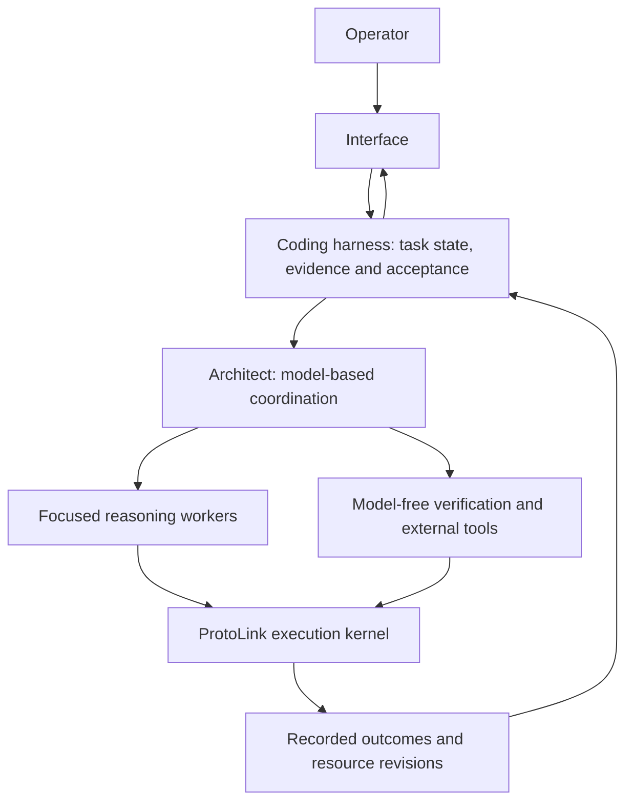
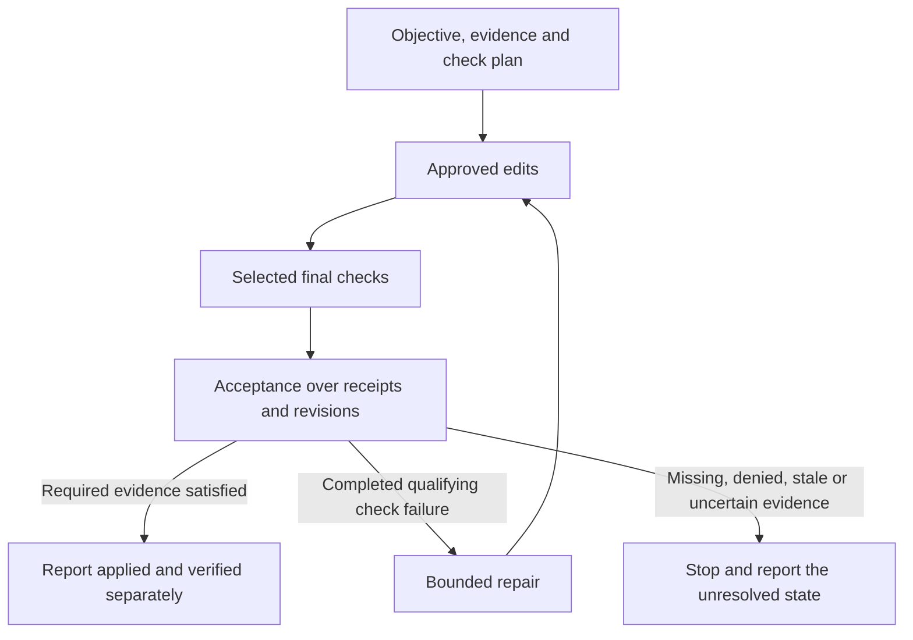

# ProtoAgent: A Coding Agent Harness for Small Language Models

**Abstract.** ProtoAgent explores whether a coding agent can make more effective
use of a smaller language model by assigning bookkeeping, evidence management,
execution control and completion checks to software. Its central proposal is an
asymmetric architecture: a model coordinates narrow reasoning tasks, while a
deterministic harness maintains task state, constrains actions and evaluates
recorded execution evidence. Specialized workers are used selectively, and
operations that do not require reasoning run without a model. This includes a
broker for external tools that exposes capabilities progressively instead of
loading a complete tool catalog into every prompt.

The project separates the reusable coding harness from its terminal interface
and builds on ProtoLink's execution primitives. This paper develops the design
rationale, describes its trust and verification boundaries, and proposes an
evaluation method. Practical implementation details follow at the end. The
architecture is implemented, but improvements in coding success, latency or cost
remain hypotheses to be tested through comparative evaluation.

## 1. Motivation and scope

A coding task combines several kinds of work: locating relevant files,
understanding behavior, retaining the user's objective, producing an edit,
choosing checks, interpreting failures and reporting what actually happened.
These responsibilities compete for a model's context and attention. A large
history or tool catalog can occupy space that would otherwise hold the source
and requirements needed for a decision.

ProtoAgent focuses on models that operate under constrained reasoning, context
or deployment budgets. Parameter count, quantization and hosting location are
useful deployment descriptors, but none alone establishes a model's capability.
The design should therefore work with both local and hosted models while making
the costs of coordination and context explicit.

The research question is whether a carefully designed harness can improve the
number of independently accepted coding changes achieved within a limited
model budget. The goal is not to assume that enough agents can compensate for
any reasoning deficit. A model may still misunderstand a requirement, choose
the wrong files or produce an incorrect implementation. The harness should make
those failures easier to detect and less likely to become unsupported success
claims.

## 2. Design thesis: externalize state, bound decisions, measure effects

The model should spend its reasoning capacity on decisions that need judgment:
what evidence is missing, which behavior should change, how to express the edit,
and what the observed checks mean. The harness should retain the objective,
retrieve actual source, enforce permissions, track effects and determine whether
the required execution evidence exists.

This allocation has three consequences.

First, task continuity must not depend entirely on conversation memory. A model
can lose observations as context is reduced, while an explicit task record
continues to preserve the objective and obligations.

Second, specialization must earn its overhead. A focused worker can isolate
irrelevant history and expose fewer tools, but delegation also costs tokens,
latency and another opportunity to misunderstand the task. Extra roles are
useful when they contribute evidence or a distinct decision, not simply because
they make the system look more sophisticated.

Third, completion must be grounded in effects. A proposed patch, an approval, a
worker's confidence and a successful check are different kinds of evidence.
The harness must preserve those distinctions when reporting the result.

A useful conceptual context budget is:

```text
instructions + current task + evidence + tool schemas + history
    + reserved output <= effective context budget
```

This is a design constraint, not a proof that a request will be tokenized
identically by every provider. Likewise, selective delegation is a design
principle rather than an implemented optimal routing algorithm. Both need
measurement under real model and repository conditions.

## 3. Architectural separation

ProtoAgent separates three responsibilities:

| Layer | Responsibility |
| --- | --- |
| Operator interface | Collect intent, select the workspace and model, present approvals, support cancellation and expose results. |
| Coding harness | Manage task state, retrieve repository evidence, route workers, prepare edits and define coding acceptance. |
| Execution kernel | Execute typed actions with policy, budgets, authentication, events, receipts and recovery primitives. |

The terminal interface is one way to operate the harness. It should not own the
meaning of verified completion, the repair policy or the authority to perform a
write. Those decisions belong below the interface so that another frontend can
reuse them when it implements the required control contract.

ProtoLink supplies the execution kernel. ProtoAgent supplies the coding-specific
architecture and acceptance rules. This keeps domain decisions close to the
application while relying on a shared execution path for approvals, processes,
file effects and reporting.


```mermaid
flowchart TD
  U[Operator] --> I[Interface]
  I --> H[Coding harness: task state, evidence and acceptance]
  H --> A[Architect: model-based coordination]
  A --> W[Focused reasoning workers]
  A --> T[Model-free verification and external tools]
  W --> K[ProtoLink execution kernel]
  T --> K
  K --> E[Recorded outcomes and resource revisions]
  E --> H
  H --> I
```

The diagram shows responsibility and evidence flow. It does not require every
request to traverse every worker. A direct answer, a repository explanation and
a code change have different evidence requirements.

## 4. Task state, memory and evidence

The architecture distinguishes conversation memory, task state and source
evidence. Conversation memory supports continuity between interactions. Task
state preserves the current objective, criteria, scope, selected checks and
worker outcomes. Source evidence describes the repository or external material
actually observed, with provenance and freshness information where available.

A summary in memory is not a substitute for the current source. Similarly, a
worker's statement that a task is finished is not a record of execution.
Separating these structures allows the harness to reduce model-facing history
without silently changing what the task requires.

Delegation should pass a narrow objective, relevant source, criteria and a clear
outcome contract. A worker can report completion of its assignment, missing
context or a blocker. Missing information should be made explicit rather than
filled with invented source. A reported blocker must remain visible until it is
resolved; it should not disappear merely because the next message sounds
confident.

The implementation retains these obligations in a runtime-owned task record.
It initializes a conservative plan before inference and freezes the selected
criteria, write scope and checks once editing or final verification begins.
Repairs inherit that plan. This prevents a failing result from becoming
successful merely by weakening the requirements after the change.

There are limits to this enforcement. The model still chooses the quality of
the criteria and can produce free-form prose. Structured reports and evidence
packets are available mechanisms, not compulsory steps on every request. A
frozen weak plan is still weak, and automatic intent classification is heuristic.

## 5. Asymmetric agents and selective specialization

An agent in this architecture is an execution boundary with a defined role and
authority. It does not necessarily contain a language model. The distinction
between reasoning workers and model-free workers is central to keeping
coordination economical.

| Role | Reasoning requirement | Responsibility |
| --- | --- | --- |
| Architect | Model | Coordinate the task, choose scope, combine evidence and explain outcomes. |
| Explorer | Model | Find relevant ownership and inspect source and tests. |
| Coder | Model | Interpret the requested change and prepare focused edits and regression tests. |
| Tester | Optional model worker | Propose regression cases and analyze observed failures without writing or executing. |
| Verifier | No model | Execute approved check specifications and return measured results. |
| Scout | Optional, no model | Retrieve public-web evidence. |
| External-tool broker | Optional, no model | Discover capabilities, return one schema and invoke an approved tool. |

The Verifier is a ProtoLink agent with registered tools. In the coding harness,
it exposes `run_check(check_id, phase)` for selected repository checks and
`execute_command` for approved preparation. The Architect invokes those tools
directly; the Verifier executes them without an LLM inference loop.

The Architect is the routing authority. Workers have task-local contexts and do
not create their own delegation trees. This bounds coordination depth and makes
handoffs visible, although it also makes the controller a potential bottleneck.

Separating test design from editing can provide another perspective on a
change. It does not establish independent correctness: both workers may use the
same model, misunderstand the same requirement or overlook the same case.
Execution evidence comes from the Verifier, and semantic acceptance ultimately
depends on the quality of the checks.

Optional roles let users trade additional perspectives or external access
against cost and latency. Disabling a test-design worker should remove its
model and discovery overhead while preserving the requirement to verify code
changes. Required enforcement must therefore remain in the harness rather than
depend on an optional agent being present.

## 6. Context as a managed resource

Repository context should be supplied progressively. A deterministic index can
orient the controller toward likely files; bounded source reads then provide
the exact material needed for an edit. This avoids treating either a large
repository dump or an inferred summary as sufficient evidence.

ProtoAgent's Context Loom performs indexing and source-cited retrieval without
a model. Workers can request focused source spans, and Coder can read the source
it needs directly. Exact edits refer to observed source and a resource revision;
ambiguous or stale replacements fail before mutation.

Request admission accounts for instructions, task state, observations, tool
schemas and agent metadata while reserving output space. Older observations can
be evicted, keeping complete tool-call/result groups together. Obligations
remain in runtime state, and missing source can be read again. Required content
that cannot fit should produce an explicit failure rather than silent removal
of the current task.

Compact prompts reduce repeated protocol examples and unnecessary output
schemas while retaining exact input contracts. Prompt profiles can adjust
verbosity and coordination style; they do not change permissions. Capability
inference from a model name remains an approximation that a user can override.

These mechanisms introduce their own costs. Retrieval can miss important
context, truncation can hide an edge case, and evicted observations may need to
be fetched again. Deterministic retrieval means the procedure does not use an
LLM; it does not mean the retrieved evidence is complete or relevant. Context
management must therefore be evaluated alongside coding accuracy.

## 7. Verification, bounded repair and recovery

The harness distinguishes three outcomes: a change was applied, selected checks
passed against the relevant state, and those checks support the task's criteria.
None of these alone proves arbitrary natural-language correctness.

Repository checks are captured before model execution. The model can select
existing checks while planning, but cannot substitute an arbitrary successful
command for them or remove a requirement after editing. Baseline measurements
describe the original behavior; preparation commands support setup and diagnosis;
final verification supplies evidence about the resulting state.

Execution evidence must remain tied to the source it measured. If a captured
dependency changes after a check, that check cannot establish verification of
the new state. Revision tracking improves this boundary without claiming to
model every environmental input, external service or repository dependency.


```mermaid
flowchart TD
  P[Objective, evidence and check plan] --> C[Approved edits]
  C --> V[Selected final checks]
  V --> G[Acceptance over receipts and revisions]
  G -->|Required evidence satisfied| R[Report applied and verified separately]
  G -->|Completed qualifying check failure| F[Bounded repair]
  F --> C
  G -->|Missing, denied, stale or uncertain evidence| S[Stop and report the unresolved state]
```

The encouraged route does not make every worker call mandatory. Enforcement
covers policy, execution evidence, plan stability, revision freshness and repair
limits. A completed failing check can justify a focused repair. A timeout,
denial or uncertain effect requires inspection, not an automatic replay.

Approval authorizes a prepared operation; it does not establish that the
operation executed or achieved the requested behavior. File recovery can undo a
recorded write subject to revision checks, but cannot undo arbitrary process or
remote effects. These boundaries should remain visible in the interface and
the final report.

## 8. External tools without a larger reasoning loop

External integrations enlarge the set of available actions, but a complete
catalog can also enlarge every model request. ProtoAgent applies progressive
discovery through a model-free broker: find relevant tool names, inspect one
exact schema, then invoke the selected capability with validated arguments.
The controller passes focused results to workers that need them.

The Model Context Protocol defines tool discovery and invocation contracts;
the broker controls how those capabilities enter the coding harness. See the
[MCP tools specification](https://modelcontextprotocol.io/specification/2025-11-25/server/tools).
Server identity remains separate from tool identity, allowing identical tool
names on different servers without ambiguity. No additional model is needed to
interpret a tool call that is already specified.

This design exchanges eager schema loading for discovery steps and connection
latency. Small catalogs may be cheaper to expose directly; large or rarely used
catalogs may benefit from the broker. That tradeoff is measurable rather than an
automatic advantage.

External descriptions, schemas and results are untrusted evidence. A server's
read-only annotation cannot establish safe effects or replace authorization.
Discovery can itself start a local process or contact a remote service, so the
execution boundary covers connections as well as invocations. A failed started
invocation may have produced effects and must stop further effectful work until
inspection and a new instruction.

External receipts do not satisfy local repository verification. An MCP server
may operate outside the harness's workspace file tools, and its effects are not
covered by those tools' checkpoints. Approval and explicit tool allowances are
controls over access, not a filesystem sandbox.

## 9. Evaluation and relationship to existing systems

Separate worker contexts, restricted tools and specialized prompts are
established coding-agent patterns. For example, Claude Code documents subagents
with their own context, prompts, tool access and permissions. Those features
are reference points, not a novelty claim for ProtoAgent. See Anthropic's
[subagent documentation](https://code.claude.com/docs/en/sub-agents).

ProtoAgent's proposed contribution is their combination with runtime-owned task
state, deterministic repository retrieval, bounded editing, progressive external
access and revision-bound acceptance, designed around constrained model budgets.
The relevant result is more independently accepted work per unit of resources,
not the number of roles or the sophistication of the interface. This paper does
not establish product parity or superiority over Claude Code.

A useful evaluation compares the harness with a single model-facing agent using
the same model, task, editing capabilities and check policy. Acceptance should
be measured independently of both the agents' claims and the tests they can
change. Repeated tasks across model sizes, quantizations, context windows and
repository types are needed to distinguish reliable gains from favorable cases.

| Measurement | Question answered |
| --- | --- |
| Independent acceptance rate | Did the resulting change meet the evaluation criteria? |
| False completion rate | Did the application report completion for an incorrect result? |
| Latency, model calls and token use | What overhead did coordination and retrieval introduce? |
| Repair counts and unresolved outcomes | How often did the system recover, stop or lack evidence? |
| Context pressure and repeated reads | Did context management preserve useful information economically? |

Ablations should remove one mechanism at a time: optional test design, explicit
task state, context admission or progressive tool discovery. Improvements in
one metric should be considered alongside regressions in others. These
experimental conditions should keep permission policy and independent acceptance
criteria fixed. Evaluation records should retain model settings, task and
repository identity, runtime configuration and source revision so that conditions
can be reproduced.

The implemented evaluation harness is an initial instrument, not evidence of a
general advantage. Plumbing tests demonstrate that controls and receipts work;
they do not establish coding capability. Comparative live model results remain
to be collected and published.

## 10. Limitations and research directions

The controller can choose a poor scope or misinterpret evidence. Multiple
workers can share correlated errors, and extra handoffs may worsen a task under
a tight budget. Frozen plans, narrow tools and explicit reports cannot create
the missing reasoning ability.

Repository checks provide only the coverage they implement. Intent
classification and model-capability selection are heuristic. Context accounting
uses estimates, and dependency capture is incomplete. Host processes and
external servers are not security-isolated by this architecture; access controls
and file recovery have narrower guarantees.

The research priorities are comparative evaluation and component ablations,
followed by stronger isolation, better criterion-to-test evidence, broader check
discovery and capability calibration based on measured behavior. Richer tasks
and larger repositories are needed before drawing conclusions about practical
generality. These directions are proposals rather than implemented guarantees.

## 11. Practical realization in the monorepo

The repository contains two active product components: a Python coding harness
in `core/` and a Rust operator interface in `cli/`. ProtoLink is their execution
dependency. The harness and interface are developed together, but their
responsibilities remain distinct.

### 11.1 Harness and interface boundaries

The Python core owns Context Loom, the task record, role prompts, worker
assembly, prepared-edit adapters, check selection and completion predicates.
It configures native ProtoLink agents, policies, budgets, events, process tools
and recovery storage rather than introducing a second execution engine.

The Rust CLI embeds the core through PyO3 and exchanges structured JSON. It
provides shell and fullscreen terminal operation, workspace/model selection,
diff review, approval presentation, cancellation and trace inspection. Native
approval decisions bind to the exact request, action fingerprint and authorized
run scope; a UI display alone cannot certify execution or completion. Another
frontend would need to implement that approval and cancellation contract before
it could operate the same harness.

### 11.2 Implemented mechanisms and their bounds

| Mechanism | Practical behavior |
| --- | --- |
| Task state | `TaskRecord` retains the objective, criteria, selected checks, source dependencies and worker reports. Plans freeze at the first write or final check. |
| Source and edits | Bounded reads carry a SHA-256 revision. `edit_file(path, old, new, expected_revision)` requires a unique old span and a matching revision before preparing a native recoverable write. |
| Context admission | Requests reserve output space and retain required instructions/task state. Small profiles with unknown capacity use an 8,192-token application cap; accounting remains estimated. |
| Repository checks | `.protoagent/project.json` declares check IDs, argv, cwd, environment and dependency paths. Bounded manifest inspection provides conventional fallbacks without executing discovery commands. |
| Acceptance | Code changes require native applied-write evidence and all selected final checks at captured revisions. Explicit documentation-only work may complete as unverified. Dependency capture is bounded to 512 files. |
| Repair | The native workflow permits one initial attempt and at most two repairs after completed qualifying check failures. Missing or uncertain evidence does not trigger replay. |
| MCP access | Three fixed broker tools provide name discovery, one exact schema and an allowlisted invocation. Pages contain at most 12 descriptors; schemas over 12,000 characters are rejected and results over 6,000 characters are marked truncated. |

These numerical bounds are implementation choices, not universal optima.
Context and MCP result limits constrain model handoffs; they do not guarantee
exact provider token counts or bound data already decoded by the MCP SDK. Source
pagination does not yet provide character-offset continuation for a very long
individual line.

The model-capable roles use the selected provider/model; there is no automatic
escalation to a stronger model. The normal deck requires Architect, Explorer,
Coder and Verifier. Tester defaults on, while Scout and MCP default off. Disabled
optional workers are neither constructed nor registered, and the controller's
instructions reflect their absence. Without Tester, Architect defines criteria
and Coder adds regressions while required checks remain enforced.

The MCP implementation uses ProtoLink's native adapter for stdio, SSE and
Streamable HTTP, pagination, original schemas and result/error normalization.
Each operation owns a managed session in one async task; discovery and invocation
within that operation share it. Runtime connections and invocations require
approval. HTTP authentication references environment variables. Failed started
invocations mark external effects uncertain and block later invocations, writes,
restores and commands in the run. Evidence reads remain available. The
integration covers tools; resources, prompts, OAuth login and server installation
are outside its implemented scope.

### 11.3 Operating the harness

The CLI exposes the architecture's controls without requiring a model to change
configuration:

```bash
proto-cli agents                     # Inspect roles, authority and availability
proto-cli agents tester off          # Skip the test-design model worker
proto-cli mcp                        # Inspect external-tool setup and status
proto-cli mcp add docs ./docs-mcp.json
proto-cli mcp test docs               # Explicit discovery probe; no tool invocation
proto-cli mcp on                      # Enable the broker for subsequent runs
proto-cli eval coding --plan          # Inspect evaluation conditions without a model
```

The terminal UI provides corresponding `/agents` and `/mcp` commands. Optional
settings persist in user configuration and apply to the next run. A run retains
its own configuration snapshot.

The coding evaluation creates disposable exercises for empty-input arithmetic,
whitespace normalization and cross-file boolean conversion. It compares the
deck with an internal single-agent condition, using an independent acceptance
script outside the normal worker workspace. Completion that fails the oracle is
recorded as false completion. External Scout/MCP access is disabled in these
fixtures. Generated code executes on the host, so the oracle arrangement is not
a tamper-proof evaluation sandbox. The small task set and one run per condition
are a starting point for the broader evaluation described above.

### 11.4 Implementation and further reading

| Responsibility | Source |
| --- | --- |
| Task records and worker packets | [`task_record.py`](core/protoagent_core/task_record.py) |
| Worker roles and optional composition | [`agents/`](core/protoagent_core/agents/) |
| Prepared edits and check actions | [`editing.py`](core/protoagent_core/editing.py) |
| Request admission | [`request_budget.py`](core/protoagent_core/request_budget.py) |
| Repository retrieval | [`context/`](core/protoagent_core/context/) |
| Authority and execution phases | [`runtime_policy.py`](core/protoagent_core/runtime_policy.py) |
| Acceptance and repair routing | [`verification.py`](core/protoagent_core/verification.py), [`workflow.py`](core/protoagent_core/workflow.py) |
| External-tool brokerage | [`mcp.py`](core/protoagent_core/mcp.py) |
| Independent coding evaluation | [`coding_eval.py`](core/protoagent_core/coding_eval.py) |
| Operator interface | [`cli/src/`](cli/src/) |

Operational details belong in the [task workflow guide](docs/content/core/task-workflow.md),
[MCP guide](docs/content/core/mcp.md) and [evaluation guide](docs/content/core/quality-evals.md).
The [core architecture documentation](docs/content/core/architecture.md) describes
the frontend API, and the [ProtoLink project](https://github.com/nMaroulis/protolink)
documents the underlying execution framework.
